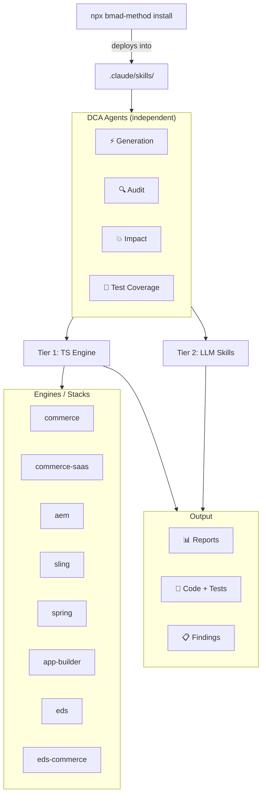

# BMAD DEPT Code Agent

[](https://github.com/mayur434/bmad-dept-code-agent)

---

## The BMAD Framework

[BMAD Method](https://github.com/bmadcode/bmad-method) is a modular AI-agent framework that lets you compose specialized skills into any AI coding tool (Claude Code, Cursor, VS Code Copilot, etc.). Modules are installed into your project with a single CLI command and extend your agent with domain-specific knowledge, scripts, and workflows — no custom infrastructure needed.

This repository is a **custom BMAD module** (`dca`) that plugs directly into the framework.

---

## What We Built

A four-agent AI suite purpose-built for **Adobe platform** and **JVM** projects — Adobe Commerce (PaaS + SaaS), AEM (AEMaaCS + AMS), Edge Delivery Services (and EDS+Commerce), Adobe App Builder, plus Apache Sling/Shaft and Spring Boot.

### Coverage Matrix

Every agent supports all eight stacks:

| Agent | Commerce PaaS | Commerce SaaS | AEM (aaCS + AMS) | Sling / Shaft | Spring Boot | App Builder | EDS | EDS + Commerce |
|-------|:---:|:---:|:---:|:---:|:---:|:---:|:---:|:---:|
| **Audit** (Scanner + LLM) | ✅ | ✅ | ✅ | ✅ | ✅ | ✅ | ✅ | ✅ |
| **Code Generation** (Scaffolders + MCP/LLM) | ✅ | ✅ | ✅ | ✅ | ✅ | ✅ | ✅ | ✅ |
| **Impact Analysis** (Input-driven tracer) | ✅ | ✅ | ✅ | ✅ | ✅ | ✅ | ✅ | ✅ |
| **Test Coverage** (Scanner + LLM) | ✅ | ✅ | ✅ | ✅ | ✅ | ✅ | ✅ | ✅ |

> ✅ = Implemented. &nbsp;&nbsp; The former standalone **Scan** agent is retired — its Tier‑1 deterministic scan now runs as the Audit agent's **Scan Only** action.

### What Each Agent Does

| Agent | Tier 1 (TypeScript, deterministic) | Tier 2 (LLM Skills) |
|-------|-----------------------------------|---------------------|
| **Audit** | tree-sitter AST + regex static scan → standardized Excel + MD report (includes a **Scan Only** action for the deterministic pass) | Architecture, data flow, business-logic deep analysis driven by per-stack rule packs |
| **Code Generation** | Correct-by-construction scaffolders (24 types across 8 stacks) | LLM/MCP generation, with zero-config MCP auto-provisioning for AEM |
| **Impact Analysis** | Input-driven tracer (`--bugs` Proofhub CSV and/or `--brd` doc) → reverse-dependency blast radius + risk scoring | Risk-assessment and blast-radius interpretation |
| **Test Coverage** | Coverage-gap detection + real line/branch coverage (JaCoCo/Istanbul/Clover/LCOV) | Generates unit/integration/functional tests toward 100% |

Every run emits the same standardized outputs: a timestamped `<agent>-<branch>-<timestamp>-agent-report.xlsx`, a Markdown twin, and an appended `CHANGE-LOG.md` — plus an optional `dca/<agent>-<stack>-<timestamp>` working branch when `--create-branch` is passed.

### Module Architecture



> Agents are **independent** — use any one on its own. Listed in SDLC order (generate → audit → test → impact) but with no dependencies between them. Each agent uses Tier 1 (TypeScript deterministic engine) + Tier 2 (LLM skills). All 8 audit engines (commerce, commerce-saas, aem, sling, spring, app-builder, eds, eds-commerce) ship Tier‑1 deterministic scanners; the former standalone Scan agent is retired and its scan now runs as the Audit agent's **Scan Only** action.

---

### Project Structure — In Detail

#### How BMAD Framework + DCA Module Connect

```
your-project/                          ← Your Adobe Commerce / AEM / EDS project
├── .claude/
│   └── skills/                        ← BMAD installs skills here
│       ├── bmad-dept-code-audit-agent/
│       ├── bmad-dept-code-generation-agent/
│       ├── bmad-dept-code-test-coverage-agent/
│       ├── bmad-dept-code-impact-analysis-agent/
│       └── shared/                    ← @bmad/dca-shared runtime foundation
├── .bmad/
│   └── mcp-registry.toml             ← MCP server config (Code Gen)
├── .mcp.json                          ← IDE MCP connections
├── .env                               ← Platform credentials (gitignored)
└── [your project files]
```

The BMAD installer (`npx bmad-method install`) reads our `module.yaml` + `marketplace.json` and deploys each agent skill into the target project's `.claude/skills/` folder.

#### DCA Module Source Layout

```
bmad-dept-code-agent/                  ← This repository (the custom module)
├── .claude-plugin/
│   └── marketplace.json               ← Marketplace manifest (module version 3.0.0)
├── README.md
├── MANUAL.md
├── IMPLEMENTATION-PLAN.md
├── PROMPTS.md
├── tools/coverage-report/             ← Builders for the DCA coverage deliverables
└── skills/
    ├── module.yaml                    ← Module manifest (agents list, config vars)
    ├── module-help.csv                ← Menu/capability registry
    ├── shared/                        ← @bmad/dca-shared runtime foundation (report, git, AST, preflight)
    ├── bmad-dept-code-audit-agent/
    ├── bmad-dept-code-generation-agent/
    ├── bmad-dept-code-test-coverage-agent/
    └── bmad-dept-code-impact-analysis-agent/
```

Each agent folder follows the same structure:

```
bmad-dept-code-*-agent/
├── SKILL.md                   ← AI instructions (activation, workflow, modes)
├── GUIDE.md                   ← Human instructions (setup, examples)
├── customize.toml             ← Activation keywords, commands, scripts
├── assets/                    ← Agent-local registry copy (module-help.csv, module.yaml)
├── resources/                 ← Knowledge base (rule packs, strategies)
├── templates/                 ← LLM-path output templates
└── scripts/
    ├── run.ts                 ← CLI dispatcher (entry point + preflight)
    ├── package.json           ← Node.js dependencies
    ├── tsconfig.json          ← TypeScript config
    ├── shared/                ← Agent-local helpers
    └── engines/               ← Per-stack engines (Audit agent shown)
        ├── registry.ts        ← Platform auto-detection + engine resolution (8 engines)
        ├── aem/               ← AEMaaCS / AEM AMS engine
        ├── commerce/          ← Adobe Commerce (Magento 2) engine
        ├── commerce-saas/     ← Adobe Commerce SaaS engine
        ├── sling/             ← Apache Sling / Shaft engine
        ├── spring/            ← Spring Boot engine
        ├── app-builder/       ← Adobe App Builder engine
        ├── eds/               ← Edge Delivery Services engine
        └── eds_commerce/      ← EDS + Commerce hybrid (note: underscore dir; ID is `eds-commerce`)
```

> The standardized report, output/git helpers, preflight advisor, and tree-sitter AST layer live once in the top-level `skills/shared/` foundation (`@bmad/dca-shared`) and are imported by all four agents.

#### File Roles Explained

| File | Who Reads It | Purpose |
|------|:------------:|---------|
| `SKILL.md` | AI Agent | Workflow instructions, activation triggers, operating modes |
| `GUIDE.md` | Human | Setup steps, usage examples, troubleshooting |
| `customize.toml` | BMAD Framework | Activation keywords, named commands, script paths |
| `assets/module.yaml` | BMAD Installer | Agent metadata for module registry |
| `assets/module-help.csv` | BMAD Help | Capabilities listing for `bmad-help` queries |
| `resources/` | AI Agent (Tier 2) | Rule packs, detection strategies, scoring models |
| `templates/` | AI Agent (Tier 2) | LLM-path output templates |
| `scripts/run.ts` | CLI / Agent | Entry point — preflight → arg parsing → engine dispatch |
| `scripts/engines/registry.ts` | Dispatcher | Maps stack IDs → detection logic → engine modules (8 engines) |
| `scripts/engines/*/audit.ts` | Dispatcher | Per-stack engine entry point (`main()`) |
| `skills/shared/report/standard-report.ts` | All agents | Standardized Excel report (up to 6 sheets; 15-column Summary contract) |
| `skills/shared/output/emit.ts` | All agents | Emits the `.xlsx` + `.md` twin + `CHANGE-LOG.md`, optional branch cut |
| `skills/shared/preflight/index.ts` | Dispatcher | Detects model + context window, sizes project, recommends STATIC/HYBRID/LLM |
| `skills/shared/ast/` | Engines | web-tree-sitter (WASM) AST layer — Java / JS / PHP scanners |

#### Commerce Engine (Legacy-family Reference)

The Audit agent's Commerce engine is a good end-to-end reference. It belongs to the **legacy engine family** (aem, commerce, eds, eds-commerce): it keeps its original regex scanner and platform-specific multi-sheet Excel, adds a tree-sitter AST precision pass, and also emits the shared standardized report. The four **newer** engines (sling, spring, app-builder, commerce-saas) are built directly on the shared tree-sitter harness and emit only the standardized report.

```
scripts/engines/commerce/
├── audit.ts              ← Entry point (CLI arg parsing, orchestration)
├── ast-scan.ts           ← PHP tree-sitter AST precision pass (shared/php scanner)
├── config.json           ← Project-specific overrides (paths, thresholds)
└── lib/
    ├── scanner/
    │   ├── index.ts      ← Main regex scanner class (multi-category)
    │   ├── types.ts      ← Finding, FindingsMap, Thresholds interfaces
    │   ├── context.ts    ← File discovery (PHP, XML, PHTML via fast-glob)
    │   ├── scans-code.ts     ← Security, Performance, Deprecated, Caching
    │   ├── scans-arch.ts     ← DI, Plugins, Crons, GraphQL, Config
    │   ├── scans-infra.ts    ← Cloud, PHP deep, Observers, Metrics
    │   ├── scans-business.ts ← Business logic, MSI, Admin security
    │   ├── scans-quality.ts  ← Standards, Validation, Compat, XSD
    │   └── db-analysis.ts    ← SQL dump parsing, schema validation (--db)
    ├── brd_analyzer.ts   ← BRD requirement → code impact mapping (--brd)
    ├── brd_parser.ts     ← .docx BRD document parser
    ├── bug_parser.ts     ← .xlsx bug report parser (--bugs)
    ├── impact.ts         ← Patch/upgrade breaking-change analysis
    ├── report.ts         ← Legacy platform-specific Excel report (ExcelJS)
    ├── expert.ts         ← Expert-level finding enrichment
    └── styles.ts         ← Excel styling constants
```

#### Adding a New Platform Engine

1. Create `scripts/engines/<stack>/`
2. Add `audit.ts` with a `main()` entry point — build `Finding[]` from the shared AST scanners (`skills/shared/java` / `js` / `php`) and/or your own rules
3. Register the stack in `engines/registry.ts` with a `detect()` function (registration order is also the auto-detection order)
4. Emit results through `emitStandardOutputs()` (`skills/shared/output/emit.ts`)
5. The dispatcher (`run.ts`) handles the rest — preflight, CLI parsing, engine resolution, output routing

Report generation is standardized: hand your `Finding[]` to `emitStandardOutputs()` and both the `.xlsx` (15-column Summary contract) and its `.md` twin are produced, with a `CHANGE-LOG.md` entry appended.

#### Preflight Validation

Before dispatching to any engine, the dispatcher runs an advisory preflight:

1. **Model + context-window detection** — reads provider model env vars and the host tool (Claude Code / Copilot / Cursor / VS Code) and maps to a context-window size
2. **Project size estimation** — globs source files, counts LOC, estimates token cost
3. **Mode recommendation** — `STATIC` (project fits ≥ 60% of the window → run the deterministic scanner first), `LLM` (≤ 12% → the LLM can reason over the code directly), otherwise `HYBRID`

Run only the advisory and exit with `--preflight`; suppress it on a normal run with `--no-preflight`.

---

## Install

### Prerequisites

- **Node.js** v20.12+
- A target project where you want the agents installed

### Fresh Install (from Git)

```bash
cd /path/to/your-project

npx bmad-method install \
  --directory . \
  --modules bmm,bmb \
  --custom-source https://github.com/mayur434/bmad-dept-code-agent.git \
  --tools claude-code \
  --yes
```

### Fresh Install (from local clone)

```bash
npx bmad-method install \
  --directory . \
  --modules bmm,bmb \
  --custom-source /path/to/bmad-dept-code-agent/skills \
  --tools claude-code \
  --yes
```

After install, dependencies are auto-installed on first use. To pre-install manually, install the shared foundation first, then each agent's scripts:

```bash
cd .claude/skills/shared && npm install
cd ../bmad-dept-code-audit-agent/scripts && npm install
```

---

## Update

```bash
cd /path/to/your-project

# Quick update — preserves settings, syncs module files only
npx bmad-method install \
  --directory . \
  --action quick-update \
  --custom-source https://github.com/mayur434/bmad-dept-code-agent.git \
  --yes

# Full update — re-resolves everything, allows config changes
npx bmad-method install \
  --directory . \
  --action update \
  --custom-source https://github.com/mayur434/bmad-dept-code-agent.git \
  --yes
```

Then reinstall deps (shared foundation first):

```bash
cd .claude/skills/shared && npm install
cd ../bmad-dept-code-audit-agent/scripts && npm install
```

### Uninstall

```bash
npx bmad-method uninstall --directory .
```

### Useful Flags

| Flag | Purpose |
|------|---------|
| `--action quick-update` | Fast sync — preserves all config |
| `--action update` | Full update — can modify modules/config |
| `--custom-source <url\|path>` | Git URL or local `skills/` folder path |
| `--yes` | Non-interactive, accept defaults |
| `--channel next` | Use latest HEAD instead of stable tag |
| `--pin CODE=TAG` | Pin module to specific release tag |
| `--set module.key=value` | Override config non-interactively |

---

## Configuration

### Supported Engines

The Audit agent registers 8 engines (`--engine` IDs). Auto-detection iterates them in registration order and, on a multi-match, prefers `eds-commerce`.

| Engine (`--engine`) | Platform | Tier-1 analysis | Status |
|--------|----------|-----------------|--------|
| `commerce` | Adobe Commerce / Magento 2 (PHP) | Legacy regex scanner + PHP tree-sitter AST pass | Implemented |
| `commerce-saas` | Adobe Commerce SaaS (Catalog / Live Search / drop-ins) | JS tree-sitter AST + config | Implemented |
| `aem` | AEM as a Cloud Service / AEM AMS (Java) | Legacy regex scanner + Java tree-sitter AST pass | Implemented |
| `sling` | Apache Sling / Shaft, sling-12 (Java) | Pure Java tree-sitter AST | Implemented |
| `spring` | Spring Boot middleware (Java) | Java tree-sitter AST + regex + config parse | Implemented |
| `app-builder` | Adobe App Builder / I/O Runtime (JS) | JS tree-sitter AST + config | Implemented |
| `eds` | Edge Delivery Services (JS) | Legacy regex scanner + JS tree-sitter AST pass | Implemented |
| `eds-commerce` | EDS + Commerce Hybrid (on-disk dir `eds_commerce`) | Legacy regex scanner + reuses EDS JS AST pass | Implemented |

### Standalone Scanner (without BMAD)

Run the TypeScript scanner directly (install the shared foundation first):

```bash
cd skills/shared && npm install
cd ../bmad-dept-code-audit-agent/scripts && npm install

# Auto-detect stack and run the Tier 1 scan (preflight runs automatically)
npx ts-node run.ts --path /path/to/your/project --name "Project Name"

# Explicit engine (commerce | commerce-saas | aem | sling | spring | app-builder | eds | eds-commerce)
npx ts-node run.ts --engine commerce --path /path/to/project

# Suppress the preflight advisory
npx ts-node run.ts --path /project --no-preflight

# List available engines
npx ts-node run.ts --list-engines
```

---

## Getting Started

See **[MANUAL.md](MANUAL.md)** for full operational details:

- Repository structure and key files
- How to create a new skill module from scratch
- Naming conventions and file contracts
- The SKILL.md / GUIDE.md / customize.toml relationship
- Pre-flight checklist before publishing

---

## Prompts

See **[PROMPTS.md](PROMPTS.md)** for the complete prompt reference organized by agent and platform.

Quick examples to get going:

```text
# Audit (Commerce)
audit my project
scan my project and name it "Client Name"
scan my project with DB dump at /path/to/dump.sql
deep audit my project
full audit my project

# Code Generation (AEMaaCS)
create a new AEM component called Hero Banner
generate a Sling Model for the Article component
create Cloud Manager pipeline configuration

# Code Generation (Commerce)
create a new Commerce module Acme_CustomShipping
create an after plugin on Magento\Catalog\Model\Product::getName
add a GraphQL resolver for querying custom entity by ID

# Code Generation (App Builder)
create an App Builder action for order sync
generate API Mesh configuration
scaffold Commerce Admin UI extension for custom order view
create an AEM UI extension for Content Fragment Console

# Test Coverage
analyze test coverage
run real coverage with the project's coverage tool
generate tests for the Checkout module
full test coverage

# Impact Analysis
trace the impact of these bugs at /path/to/proofhub-export.csv
analyze the impact of the BRD at /path/to/brd.docx
```

After an audit completes, follow up with:

```text
summarize the audit findings
show me all CRITICAL severity items
create a fix plan for the critical items
estimate effort to fix all HIGH and CRITICAL findings
```

---

## License

MIT
