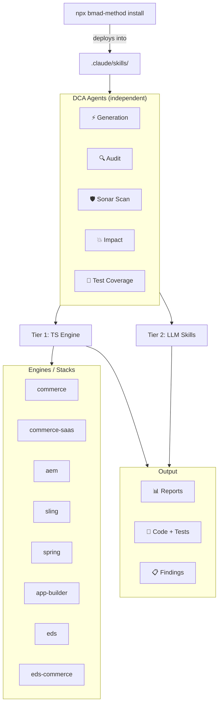

# BMAD DEPT Code Agent

[](https://github.com/mayur434/bmad-dept-code-agent)
[](LICENSE)
[](.claude-plugin/marketplace.json)

> A five-agent AI suite (module code `dca`) for Adobe platform and JVM SDLC — audit, sonar-scan, generate, analyse impact, and reach 100% test coverage across eight tech stacks with one standardized report shape.

---

## Table of Contents

- [TL;DR](#tldr)
- [The BMAD Framework](#the-bmad-framework)
- [What is DCA](#what-is-dca)
- [Coverage Matrix](#coverage-matrix)
- [The 5 agents — at a glance](#the-5-agents--at-a-glance)
- [Standardized outputs contract](#standardized-outputs-contract)
- [Architecture](#architecture)
- [The 8 stacks in detail](#the-8-stacks-in-detail)
- [Repository layout (source)](#repository-layout-source)
- [Installed layout (in a target project)](#installed-layout-in-a-target-project)
- [File roles](#file-roles)
- [Install / Update / Uninstall](#install--update--uninstall)
- [Configuration overview](#configuration-overview)
- [Role-based operation](#role-based-operation)
- [Quick start — 5-minute smoke test](#quick-start--5-minute-smoke-test)
- [Prompt library](#prompt-library)
- [Deep-dive documentation](#deep-dive-documentation)
- [Getting help / contributing](#getting-help--contributing)
- [Roadmap highlights](#roadmap-highlights)
- [License](#license)

---

## TL;DR

- **What it is** — a single BMAD module (`dca`, v4.0.0) that plugs five specialist AI coding agents into Claude Code (or any BMAD-compatible tool) via `npx bmad-method install`.
- **Compatibility** — works with every AI coding tool BMAD Method supports (44+ IDs): Claude Code, Cursor, GitHub Copilot, Codex, Cline, Windsurf, Gemini CLI, Roo Code, Kilo, Sourcegraph Amp, Kiro, Junie, Warp, Zencoder, and more. Pass `--tools <id>` at install (see [Install for other AI coding tools](#install-for-other-ai-coding-tools)).
- **What it delivers** — Tier 1 deterministic TypeScript engines (tree-sitter AST + regex) plus Tier 2 LLM knowledge packs, funnelled through one shared reporting foundation.
- **What you get, every run** — a standardized `<agent>-<branch>-<timestamp>-agent-report.xlsx` + Markdown twin + `CHANGE-LOG.md` entry, with an optional working branch cut on demand.
- **Who it's for** — Enterprise Architects, tech leads, and delivery engineers on Adobe Commerce (PaaS/SaaS), AEMaaCS/AMS, Adobe App Builder, Apache Sling/Shaft, Spring Boot, and Edge Delivery Services projects.
- **Adapts to your role** — the plugin's default mode, output shape, and recommended follow-ups tune to how you use it: Enterprise Architect, Tech Lead, Senior Delivery Engineer, QA / SDET, DevOps / SRE, Security Engineer, Product Manager, Business Analyst, Migration Lead, or Content Engineer (10 roles + `generic` fallback). See [Role-based operation](#role-based-operation) below.

---

## The BMAD Framework

[BMAD Method](https://github.com/bmadcode/bmad-method) is a modular AI-agent framework that lets you compose specialized skills into any AI coding tool (Claude Code, Cursor, VS Code Copilot, etc.). Each module ships as a collection of skills — a `SKILL.md` (AI instructions), `GUIDE.md` (human docs), `customize.toml` (activation keywords + commands), and optional TypeScript engines under `scripts/`. Modules are installed into your project with a single CLI command and extend your agent with domain-specific knowledge, scripts, and workflows — no custom infrastructure needed.

BMAD handles activation, dependency wiring, config prompts, upgrades, and skill registration. This repo is a **custom BMAD module** (`dca`) that plugs directly into that framework: the installer reads our `module.yaml` and `.claude-plugin/marketplace.json`, then drops every agent skill under `.claude/skills/` in the target project.

---

## What is DCA

DCA (**D**ept **C**ode **A**gents) is a custom BMAD module that ships **five independent AI coding agents** for Adobe platform + JVM middleware projects. Each agent works on its own — no orchestration required — but they share one runtime foundation (`@bmad/dca-shared`) so every report, changelog entry, and branch cut looks identical across the fleet. The module targets eight engine stacks that span every SDLC deliverable your team ships on Adobe Commerce PaaS/SaaS, AEMaaCS/AMS, App Builder, Apache Sling/Shaft, Spring Boot, and Edge Delivery Services (including EDS+Commerce hybrids).

---

## Coverage Matrix

Every agent supports every stack. All 40 cells (5 × 8) are delivered per [IMPLEMENTATION-PLAN §3](IMPLEMENTATION-PLAN.md).

| Agent | Commerce PaaS | Commerce SaaS | AEM (aaCS + AMS) | Sling / Shaft | Spring Boot | App Builder | EDS | EDS + Commerce |
|-------|:---:|:---:|:---:|:---:|:---:|:---:|:---:|:---:|
| **Audit** (Scanner + LLM) | ✅ | ✅ | ✅ | ✅ | ✅ | ✅ | ✅ | ✅ |
| **Sonar Scan** (LLM Quality Gate) | ✅ | ✅ | ✅ | ✅ | ✅ | ✅ | ✅ | ✅ |
| **Code Generation** (Scaffolders + MCP/LLM) | ✅ | ✅ | ✅ | ✅ | ✅ | ✅ | ✅ | ✅ |
| **Impact Analysis** (Input-driven tracer) | ✅ | ✅ | ✅ | ✅ | ✅ | ✅ | ✅ | ✅ |
| **Test Coverage** (Scanner + LLM) | ✅ | ✅ | ✅ | ✅ | ✅ | ✅ | ✅ | ✅ |

> The former standalone **Scan** agent is retired — its Tier-1 deterministic scan now runs as the Audit agent's **Scan Only** action (menu `SC`). **Sonar Scan** is a distinct 5th agent added later; it is LLM-driven and produces a Quality Gate + Vulnerabilities sheet on top of the standardized report.

---

## The 5 agents — at a glance

| Agent | Icon | Tier 1 (deterministic TS) | Tier 2 (LLM skills) | Primary CLI flag |
|-------|:----:|---------------------------|---------------------|------------------|
| **Auditor** | 🔍 | tree-sitter AST + regex static scan (8 engines) → standardized Excel + MD; **Scan Only** action for a pure deterministic pass | Architecture, data-flow, business-logic deep analysis driven by per-stack rule packs | `--engine <stack>` |
| **Sonar Scanner** | 🛡️ | n/a — ingests LLM-produced findings via `--ingest sonar-findings.json` | Sonar-style analysis: Bugs, Vulnerabilities, Security Hotspots, Code Smells, Duplications, Complexity → Reliability / Security / Maintainability ratings (A–E) + Quality Gate + dedicated Vulnerabilities sheet | `--ingest <file>` |
| **Generator** | ⚡ | 24 correct-by-construction scaffolders across 8 stacks; zero-config MCP auto-provisioning for AEM | LLM/MCP path for complex generation with per-stack knowledge packs | `--scaffold <type>` / `--setup` |
| **Impact Analyst** | 💥 | Input-driven tracer (`--bugs` Proofhub CSV and/or `--brd` .docx/.md/.txt) → reverse-dependency blast radius + risk scoring; 8 stack profiles | Risk-assessment and blast-radius interpretation on top of the tracer output | `--bugs <csv>` / `--brd <doc>` |
| **Test Coverage** | 🧪 | Coverage-gap detection + real line/branch coverage (JaCoCo / Istanbul / Clover / LCOV) | Framework-aware test generation packs (JUnit + AEM/Sling Mocks, Spring Test / MockMvc, PHPUnit / MFTF, Jest) driving generation to 100% | `--run-coverage` / `--coverage-report <path>` |

Each agent's `SKILL.md` documents its full command surface — the flags above are the ones you'll type most often.

**A typical SDLC pass.** Agents are independent, but here's how they compose on a real feature. This is illustrative, not prescriptive — you can run any single agent on its own.

1. **Generator (⚡)** — scaffold the new component / module / action from a templated blueprint.
2. **Auditor (🔍)** — deterministic tree-sitter scan of the changed area, then LLM deep-audit against the per-stack rule pack.
3. **Sonar Scanner (🛡️)** — LLM Sonar-style pass over the same code → Quality Gate (A–E) + Vulnerabilities sheet on top of the standardized report.
4. **Test Coverage (🧪)** — gap analysis + real JaCoCo/Istanbul/Clover/LCOV coverage; Tier 2 LLM generates the missing tests to 100%.
5. **Impact Analyst (💥)** — feed the Proofhub bug export or the BRD to trace reverse-dependency blast radius and score risk before the release.

---

## Standardized outputs contract

Every run — from every agent, on every stack — emits the same three artifacts through the shared `emitStandardOutputs()` entry point (`skills/shared/output/emit.ts`):

1. **`<agent>-<branch>-<timestamp>-agent-report.xlsx`** — ExcelJS report built by the shared `StandardExcelReport` (`skills/shared/report/standard-report.ts`). Sheet order is fixed: **Run Info · Summary (15-column contract) · Severity Breakdown · By Category**, plus **Recommendations** (when supplied) and **Input Traceability** (Impact agent only). Sonar Scan appends a dedicated **Vulnerabilities** sheet.
2. **`<agent>-<branch>-<timestamp>-agent-report.md`** — a git-diffable Markdown twin (reduced 9-column Summary) written alongside the xlsx by default.
3. **`CHANGE-LOG.md`** — Keep-a-Changelog flavoured. Each run splices one entry after the `<!-- dca:entries -->` marker (newest first) with agent, stack, branch, findings totals, and the report filename.

Pass **`--create-branch`** to also cut a `dca/<agent>-<stack>-<YYYYMMDD_HHMMSS>` working branch from the first existing of `production → main → master → develop` (override with `--source-branch <name>`). All git ops are best-effort and degrade gracefully outside a repo.

**Example — what an Audit run on the `main` branch of a Commerce project produces:**

```
audit-reports/
├── audit-main-20260801_143022-agent-report.xlsx
└── audit-main-20260801_143022-agent-report.md
CHANGE-LOG.md      ← one new entry spliced in after the marker
```

The corresponding `CHANGE-LOG.md` entry header:

```markdown
## 20260801_143022 — `audit` — `commerce` — Acme Storefront
- **Branch:** main from main
- **Summary:** 42 findings (CRITICAL 3, HIGH 11, MEDIUM 18, LOW 10)
- **Report:** audit-main-20260801_143022-agent-report.xlsx
- **Files changed:** 0
- **Details:** …
```

The 15-column Summary contract, the entry format, and the branch policy are documented in full in [IMPLEMENTATION-PLAN §4](IMPLEMENTATION-PLAN.md).

> Legacy AEM / Commerce / EDS / eds-commerce engines additionally keep their platform-specific multi-sheet Excel alongside the standardized report — so a legacy run writes **two** xlsx files (the standard shape plus the legacy rich report). New engines (Sling, Spring, App Builder, Commerce SaaS) emit only the standardized shape.

---

## Architecture



Agents are **independent** — invoke any one on its own; there are no ordering dependencies. Listed in SDLC order (generate → audit → sonar-scan → test → impact) for readability only. Each agent combines a **Tier 1** TypeScript deterministic engine with a **Tier 2** LLM knowledge pack, and every output flows through one shared foundation (`skills/shared/`, published as `@bmad/dca-shared`) so reports, changelog entries, git helpers, and the preflight advisor stay identical across the fleet.

**Preflight advisor.** Before dispatching to any engine, the dispatcher runs an advisory preflight (`skills/shared/preflight/`): detects the current LLM + context window, sizes the project, then recommends **STATIC** (project fits ≥ 60% of the window — run the deterministic scanner first), **LLM** (≤ 12% — the model can reason over the code directly), or **HYBRID** otherwise. Run advisory-only with `--preflight`; skip it on a normal run with `--no-preflight`.

**The shared foundation (`@bmad/dca-shared`)** is the single integration seam every agent funnels through. Its subdirectories:

| Subdir | Responsibility |
|--------|----------------|
| `report/` | `StandardExcelReport` (fixed sheet order, 15-column Summary contract) + Markdown twin builder |
| `output/` | `emitStandardOutputs()` — writes xlsx + md + CHANGE-LOG + optional branch cut in one call |
| `git/` | Branch/timestamp helpers, `CHANGE-LOG.md` writer, `maybeCutStandardBranch` |
| `preflight/` | Model + context-window detection, project sizing, STATIC / HYBRID / LLM recommendation |
| `ast/` | web-tree-sitter (WASM) harness — no native build required |
| `java/` `js/` `php/` | Per-language rule libraries shared by every engine that speaks that language |
| `coverage/` | JaCoCo / Istanbul / Clover / LCOV parsers + report discovery + opt-in runner |
| `core/` | Shared types (`Finding`, `Severity`, `Confidence`, etc.) |
| `token-budget/` | Token accounting for LLM handoffs |

---

## The 8 stacks in detail

The Audit agent registers 8 engines (`--engine` IDs); the other four agents reuse the same IDs. Auto-detection iterates in registration order and, on a multi-match, prefers `eds-commerce`.

| Engine (`--engine`) | Platforms served | Tier-1 analysis | Status |
|---------------------|------------------|-----------------|--------|
| `commerce` *(alias: `commerce-paas`)* | Adobe Commerce / Magento 2 (PHP) | Legacy regex scanner + PHP tree-sitter AST precision pass | ✅ Implemented |
| `commerce-saas` | Adobe Commerce SaaS (Catalog / Live Search / drop-ins) | JS tree-sitter AST + JSON/config scan | ✅ Implemented |
| `aem` | AEM as a Cloud Service **and** AEM AMS (Java) — select with `--platform aemcs\|aemams\|both` | Legacy regex scanner + Java tree-sitter AST precision pass | ✅ Implemented |
| `sling` | Apache Sling / Shaft, sling-12 (Java) | Pure Java tree-sitter AST | ✅ Implemented (🟡 Shaft KB extension in progress) |
| `spring` | Spring Boot middleware (Java 17/21, Jakarta) | Java tree-sitter AST + regex + nested-YAML config parse | ✅ Implemented |
| `app-builder` | Adobe App Builder — Mesh, Middleware/BFF, Eventing, and UIX Apps (Node.js / React) | JS tree-sitter AST + `app.config.yaml` / `.env` / mesh config | ✅ Implemented |
| `eds` | Edge Delivery Services (JS blocks, drop-ins) | Legacy regex scanner + JS tree-sitter AST precision pass | ✅ Implemented |
| `eds-commerce` | EDS + Commerce hybrid storefronts | Legacy regex scanner + reuses EDS JS AST pass with stack ID `eds-commerce` | ✅ Implemented |

**Engine aliases and platform variants.**
- `commerce` and `commerce-paas` are aliases for the same PHP engine (Magento 2 / Adobe Commerce PaaS). Use whichever reads better in your prompt.
- `aem` serves both **AEMaaCS** and **AEM AMS** from one engine. It auto-detects the target; force with `--platform aemcs`, `--platform aemams`, or `--platform both`.
- The four App Builder variants (Mesh, Middleware/BFF, Eventing, UIX Apps) are all served by the single `app-builder` engine with variant-specific rule packs.

Full per-stack knowledge coverage (detect signals, remediation snippets, gen templates, impact-edge taxonomy, test framework mapping) is documented in [IMPLEMENTATION-PLAN §5](IMPLEMENTATION-PLAN.md).

---

## Repository layout (source)

```
bmad-dept-code-agent/                              ← This repository (the custom module)
├── .claude-plugin/
│   └── marketplace.json                           ← Marketplace manifest (module version 4.0.0)
├── README.md                                      ← This file
├── MANUAL.md                                      ← Full consumption + author's guide
├── PROMPTS.md                                     ← 481 copy-paste prompts, all 5 agents × 8 stacks
├── IMPLEMENTATION-PLAN.md                         ← Delivered-feature reality + roadmap
├── CHANGE-LOG.md                                  ← Auto-maintained per-run log
├── LICENSE                                        ← MIT
├── DCA-Agent-Coverage.xlsx / .pdf                 ← Coverage deliverables
├── DCA-Test-Commands.xlsx                         ← Standalone test command catalog
├── tools/coverage-report/                         ← Builders for the DCA coverage deliverables
└── skills/                                        ← --custom-source points here
    ├── module.yaml                                ← Module identity, agents list, config variables
    ├── module-help.csv                            ← Menu / capability registry (13-column CSV)
    ├── shared/                                    ← @bmad/dca-shared runtime foundation
    │   ├── ast/  core/  coverage/  git/           ← tree-sitter WASM, git helpers, coverage parsers
    │   ├── java/  js/  php/                       ← per-language AST rule libraries
    │   ├── output/  preflight/  report/  token-budget/
    │   ├── index.ts
    │   └── package.json · tsconfig.json
    ├── bmad-dept-code-audit-agent/                ← 🔍 Auditor
    ├── bmad-dept-code-sonar-scan-agent/           ← 🛡️ Sonar Scanner
    ├── bmad-dept-code-generation-agent/           ← ⚡ Generator
    ├── bmad-dept-code-impact-analysis-agent/      ← 💥 Impact Analyst
    └── bmad-dept-code-test-coverage-agent/        ← 🧪 Test Coverage
```

Every agent folder shares the same layout (the Audit agent is shown expanded):

```
bmad-dept-code-audit-agent/
├── SKILL.md                   ← AI instructions (activation, workflow, modes)
├── GUIDE.md                   ← Human instructions (setup, examples)
├── customize.toml             ← Activation keywords, commands, script paths
├── assets/                    ← Agent-local registry copy (module-help.csv, module.yaml)
├── resources/                 ← Knowledge base (rule packs, strategies, scoring)
├── templates/                 ← LLM-path output templates
└── scripts/
    ├── run.ts                 ← CLI dispatcher (entry point + preflight)
    ├── package.json           ← Node.js dependencies
    ├── tsconfig.json          ← TypeScript config
    ├── shared/                ← Agent-local helpers
    └── engines/               ← Per-stack engines (Audit agent shown)
        ├── registry.ts        ← Auto-detection + engine resolution (8 engines)
        ├── aem/               ← AEMaaCS / AEM AMS engine
        ├── commerce/          ← Adobe Commerce (Magento 2) engine
        ├── commerce-saas/     ← Adobe Commerce SaaS engine
        ├── sling/             ← Apache Sling / Shaft engine
        ├── spring/            ← Spring Boot engine
        ├── app-builder/       ← Adobe App Builder engine
        ├── eds/               ← Edge Delivery Services engine
        └── eds-commerce/      ← EDS + Commerce hybrid
```

---

## Installed layout (in a target project)

```
your-project/                                      ← Your Adobe Commerce / AEM / EDS / Spring / etc. project
├── .claude/
│   └── skills/                                    ← BMAD installs skills here
│       ├── bmad-dept-code-audit-agent/
│       ├── bmad-dept-code-sonar-scan-agent/
│       ├── bmad-dept-code-generation-agent/
│       ├── bmad-dept-code-test-coverage-agent/
│       ├── bmad-dept-code-impact-analysis-agent/
│       └── shared/                                ← @bmad/dca-shared runtime foundation
├── .bmad/
│   └── mcp-registry.toml                          ← MCP server config (Code Gen `--setup`)
├── .mcp.json                                      ← IDE MCP connections
├── .env                                           ← Platform credentials (gitignored)
├── audit-reports/                                 ← Configurable — see [Configuration](#configuration-overview)
├── generation-reports/
├── impact-reports/
├── sonar-reports/
├── test-coverage-reports/
├── CHANGE-LOG.md                                  ← Auto-appended per run
└── [your project files]
```

---

## File roles

| File | Who reads it | Purpose |
|------|:------------:|---------|
| `SKILL.md` | AI Agent | Workflow instructions, activation triggers, operating modes |
| `GUIDE.md` | Human | Setup steps, CLI usage examples, troubleshooting |
| `customize.toml` | BMAD Framework | Activation keywords, named commands, script paths |
| `assets/module.yaml` | BMAD Installer | Agent metadata for module registry |
| `assets/module-help.csv` | BMAD Help | Capabilities listing for `bmad-help` queries |
| `resources/` | AI Agent (Tier 2) | Rule packs, detection strategies, scoring models, gen templates |
| `templates/` | AI Agent (Tier 2) | LLM-path output templates |
| `scripts/run.ts` | CLI / Agent | Entry point — preflight → arg parsing → engine dispatch |
| `scripts/engines/registry.ts` | Dispatcher | Maps stack IDs → detection logic → engine modules (8 engines) |
| `scripts/engines/*/audit.ts` | Dispatcher | Per-stack engine entry point (`main()`) |
| `skills/shared/report/standard-report.ts` | All agents | Standardized Excel report (fixed sheet order; 15-column Summary contract) |
| `skills/shared/output/emit.ts` | All agents | Emits the `.xlsx` + `.md` twin + `CHANGE-LOG.md`, optional branch cut |
| `skills/shared/git/changelog.ts` | All agents | Keep-a-Changelog writer that splices entries at the marker (newest first) |
| `skills/shared/preflight/index.ts` | Dispatcher | Detects model + context window, sizes project, recommends STATIC / HYBRID / LLM |
| `skills/shared/ast/` + `java/` + `js/` + `php/` | Engines | web-tree-sitter (WASM) AST harness + shared per-language rule libraries |

---

## Install / Update / Uninstall

### Prerequisites

- **Node.js** v20.12+
- A target project where you want the agents installed

### Fresh install

```bash
cd /path/to/your-project

# From Git URL
npx bmad-method install \
  --directory . \
  --modules bmm \
  --custom-source https://github.com/mayur434/bmad-dept-code-agent.git \
  --tools claude-code \
  --yes
```

See the [Post-install](#post-install-auto-install-on-first-use) section below for what happens on your first agent invocation — no manual `npm install` needed.

### Install for other AI coding tools

The `dca` module works with any AI coding assistant BMAD Method supports. Pass the tool ID via `--tools`:

| Tool | `--tools <id>` | Installed under |
|------|----------------|-----------------|
| Claude Code (default, recommended) | `claude-code` | `.claude/skills/` |
| Cursor (recommended) | `cursor` | `.agents/skills/` |
| GitHub Copilot (recommended) | `github-copilot` | `.agents/skills/` |
| Codex (recommended) | `codex` | `.agents/skills/` |
| Cline | `cline` | `.cline/skills/` |
| Windsurf | `windsurf` | `.agents/skills/` |
| Gemini CLI | `gemini` | `.agents/skills/` |
| Roo Code | `roo` | `.agents/skills/` |
| Sourcegraph Amp | `amp` | `.agents/skills/` |
| Kiro | `kiro` | `.kiro/skills/` |
| Junie | `junie` | `.junie/skills/` |
| Warp | `warp` | `.agents/skills/` |
| Zencoder | `zencoder` | `.zencoder/skills/` |
| Qwen Coder | `qwen` | `.qwen/skills/` |
| ...and 30+ more | | |

Example — install into a Cursor project:

```bash
npx bmad-method install \
  --directory . \
  --modules bmm \
  --custom-source https://github.com/mayur434/bmad-dept-code-agent.git \
  --tools cursor \
  --yes
```

Discover the full 44-tool list (and each one's install directory) with:

```bash
npx bmad-method install --list-tools
```

> Each tool installs the plugin under its own conventional path — `.claude/skills/` for Claude Code, `.agents/skills/` for the shared multi-tool bucket, `.cursor/skills/`-style per-tool folders for tools that prefer isolation. The bootstrap script (`bash <skill-path>/shared/bootstrap.sh <agent>`) resolves paths from `dirname "$0"`, so it works regardless of which directory BMAD chose. Substitute `.claude/skills/` in this doc with your tool's directory throughout the commands below.

### Post-install: auto-install on first use

**No manual steps needed.** The first time you invoke any agent, it detects missing Node dependencies and asks — one line — whether to install:

> `[dca-bootstrap] First-run dependency install needed — ~80MB across shared/ and <agent>/ (~30–60s). Proceed? (Y/n)`

Confirm with **Y** (or Enter). The bootstrap installs the `shared/` foundation first, then this agent's `scripts/`, both silently. Subsequent runs are silent no-ops (both `node_modules` already present).

**Headless / CI (skip the prompt).** Every `run.ts` accepts two mutually exclusive flags:

```
--yes-install   Install missing deps without asking.
--no-install    Error if deps missing (never install).
```

**Fallback (manual, if you'd rather):**

```bash
cd .claude/skills/shared && npm install
cd ../bmad-dept-code-<agent-name>-agent/scripts && npm install
```

where `<agent-name>` is one of: `audit`, `sonar-scan`, `generation`, `impact-analysis`, `test-coverage`.

Full details, per-agent flag reference, and troubleshooting live in **[MANUAL.md](MANUAL.md)**.

### Update

```bash
# Quick update — preserves settings, syncs module files only
npx bmad-method install --directory . --action quick-update \
  --custom-source https://github.com/mayur434/bmad-dept-code-agent.git --yes

# Full update — re-resolves everything, allows config changes
npx bmad-method install --directory . --action update \
  --custom-source https://github.com/mayur434/bmad-dept-code-agent.git --yes
```

### Uninstall

```bash
npx bmad-method uninstall --directory .
```

Full flag reference (`--pin`, `--channel next`, `--set`, `--list-options`, `--list-tools`), local-clone installs, per-agent dependency ordering, and post-install verification live in **[MANUAL.md — Install / Update / Uninstall](MANUAL.md#install--update--uninstall)**.

---

## Configuration overview

`module.yaml` exposes seven config variables. All are prompted at install time and can be overridden non-interactively with `--set <key>=<value>`.

| Variable | Purpose | Default |
|----------|---------|---------|
| `audit_output` | Where audit reports land | `{output_folder}/audit-reports` |
| `generation_output` | Where scaffold + generation reports land | `{output_folder}/generation-reports` |
| `impact_output` | Where impact-analysis reports land | `{output_folder}/impact-reports` |
| `test_coverage_output` | Where test-coverage reports land | `{output_folder}/test-coverage-reports` |
| `sonar_output` | Where sonar-scan reports land | `{output_folder}/sonar-reports` |
| `audit_engine` | Default audit engine (auto-detects if unset) | `auto` — one of `auto \| aem \| commerce \| commerce-paas \| commerce-saas \| sling \| spring \| app-builder \| eds \| eds-commerce` |
| `audit_namespace` | Custom module namespace for Commerce projects | `Custom` |

See **[MANUAL.md](MANUAL.md)** for the full config reference and `--set` examples.

---

## Role-based operation

Every one of the five agents adapts its default mode, output flavor, and recommended follow-ups to the **role** of the person driving the run. Role selection is captured once per project in `<projectRoot>/.bmad/role.yaml` — the first agent invocation asks you to pick from a short list, and every subsequent run reads it silently. You can also override per-run with `--role=<code>` on any `run.ts`, or by prefixing a chat prompt with *"as `<role>`, ..."*. Ten roles are supported (six promoted, four additional) plus a `generic` fallback for teams that want to skip role gating.

| Code | Role |
|------|------|
| `ea` | Enterprise Architect (promoted) |
| `tl` | Tech Lead / Solution Architect (promoted) |
| `de` | Senior Delivery Engineer (promoted) |
| `qa` | QA / SDET (promoted) |
| `devops` | DevOps / SRE (promoted) |
| `security` | Security Engineer (promoted) |
| `pm` | Product Manager / PMO |
| `ba` | Business Analyst |
| `migration` | Migration / Upgrade Lead |
| `content` | Content / CMS Engineer |
| `generic` | Generic (fallback — no adaptation) |

Full mechanics, the `.bmad/role.yaml` schema, the 5 output flavors (`executive`, `technical`, `jira-csv`, `sarif`, `default`), and the per-agent × per-role adaptation matrix live in **[MANUAL.md — Role-based operation](MANUAL.md#4a-role-based-operation-new)**. The canonical role definitions (priority agents, default output flavor, description) live in [`skills/shared/role/ROLES.md`](skills/shared/role/ROLES.md).

---

## Quick start — 5-minute smoke test

Install the module (see above), open Claude Code in your project, and paste one of these into chat. The agent auto-detects your stack and routes to the right engine — no flags required for the happy path.

```text
audit my project
```

```text
sonar scan my project
```

```text
generate a Sling Model for the Article component
```

```text
analyze test coverage
```

```text
trace the impact of these bugs at /path/to/proofhub-export.csv
```

Prefer the CLI? Every agent ships a standalone TypeScript dispatcher.

```bash
# Auto-detect stack, run the Audit Tier-1 scan (preflight runs automatically)
npx ts-node .claude/skills/bmad-dept-code-audit-agent/scripts/run.ts --path .

# Sonar Scan is 2-step: LLM produces sonar-findings.json → deterministic ingest
npx ts-node .claude/skills/bmad-dept-code-sonar-scan-agent/scripts/run.ts \
  --ingest sonar-findings.json --path .

# List all engines the Audit agent registers
npx ts-node .claude/skills/bmad-dept-code-audit-agent/scripts/run.ts --list-engines
```

---

## Prompt library

The full copy-paste catalog lives in **[PROMPTS.md](PROMPTS.md)** — **481 prompts** across the 5 agents × 8 stacks matrix, plus multi-agent workflow chains, follow-up prompts (severity filters, fix plans, effort estimates), Enterprise-Architect prompts, cross-cutting flag templates (`--create-branch`, `--preflight`, `--coverage-report`, `--source-branch`, `--engine`), and a troubleshooting section. Every block is a ready-to-paste message for the agent chat.

---

## Deep-dive documentation

| Doc | What's inside |
|-----|---------------|
| **[MANUAL.md](MANUAL.md)** | Full consumption guide: install / update / uninstall flags, repository structure, key files, creating a new module from scratch, naming conventions, pre-flight checklist |
| **[PROMPTS.md](PROMPTS.md)** | 481 copy-paste prompts: quick-start, per-agent × per-stack, cross-cutting flags, follow-up prompts, workflow chains, troubleshooting |
| **[IMPLEMENTATION-PLAN.md](IMPLEMENTATION-PLAN.md)** | Kickoff baseline vs delivered reality, coverage matrix, standardized outputs contract (§4), per-stack knowledge packs (§5), phased roadmap, resolved decisions |
| **[CHANGE-LOG.md](CHANGE-LOG.md)** | Auto-maintained per-run log (Keep-a-Changelog format) — every agent invocation appends one entry |
| **[LICENSE](LICENSE)** | MIT |

---

## Getting help / contributing

**File a bug.** Open an issue at [github.com/mayur434/bmad-dept-code-agent/issues](https://github.com/mayur434/bmad-dept-code-agent/issues). Please attach:

- The generated `<agent>-<branch>-<timestamp>-agent-report.xlsx` (or its `.md` twin) if the run completed.
- The relevant `CHANGE-LOG.md` entry (the block under the `<!-- dca:entries -->` marker for that run).
- Your environment: Node.js version, host tool (Claude Code / Cursor / VS Code Copilot / etc.), OS, and the `--engine` you used (or a note that you let auto-detect run).
- The exact prompt or CLI command that triggered the bug, plus any preflight advisory the dispatcher printed.

**Contribute.** PRs welcome. The best entry point for extending the module is **[MANUAL.md — Creating a New Module](MANUAL.md#creating-a-new-module)** and the pre-publish checklist that follows it. For a new **engine** (a new stack under an existing agent), the recipe is: create `scripts/engines/<stack>/`, add an `audit.ts` with a `main()` entry point that builds `Finding[]` from the shared AST scanners (`skills/shared/java` / `js` / `php`) and your own rules, register the stack in `engines/registry.ts` with a `detect()` function, and emit results through `emitStandardOutputs()`. The dispatcher handles preflight, CLI parsing, engine resolution, and output routing for you.

---

## Roadmap highlights

Grounded in [IMPLEMENTATION-PLAN §7 Phase 7](IMPLEMENTATION-PLAN.md) residuals and §9 remaining inputs. All 45 delivered coverage cells are ✅ complete — the items below are open enhancements, not blockers.

- 🟡 **Shaft KB finalize (Phase 7 — in progress).** Extend Shaft rule / gen / test packs from the PPT KB across all agents; confirm exact Sling / Felix / Oak versions + build system + whether SAM and MDM ship as separate bundles. End-to-end verify identical A/B/C outputs on real Shaft projects.
- 🟡 **Registry-refresh spot-check.** The `module.yaml` agent-level description and remaining `SKILL.md` front-matter carry-over should be spot-checked so their prose matches the delivered 5-agent, 8-stack reality.
- 🟡 **Depth enhancement — XML-config AST scanning** for `di.xml` / `.content.xml` / Spring XML (Phase 3 residual). The shared AST harness handles Java / JS / PHP today; XML rules currently run through regex only.
- 🟡 **Proofhub ColumnMap CLI flag.** The parser auto-detects Proofhub CSV headers by keyword; a `ColumnMap` override exists in code but is not yet wired to a CLI flag — a real exported sample would let us tune the mapping.
- 🟡 **BRD source expansion.** Google Docs must currently be exported to `.docx` / `.txt` first (Docs API OAuth is out of scope). Confirmation from consumers that export is acceptable, or a lightweight OAuth path, would close this.

Possible future enhancements beyond the delivered plan (not currently scoped): automated integration tests across the fleet, MCP auto-provisioning for agents beyond Code Generation, a leveled logger + typed exit codes for cleaner CI wiring, and additional Adobe enterprise stacks (AEM Forms, AEP / RTCDP) if demand emerges.

---

## License

MIT — see [LICENSE](LICENSE).
