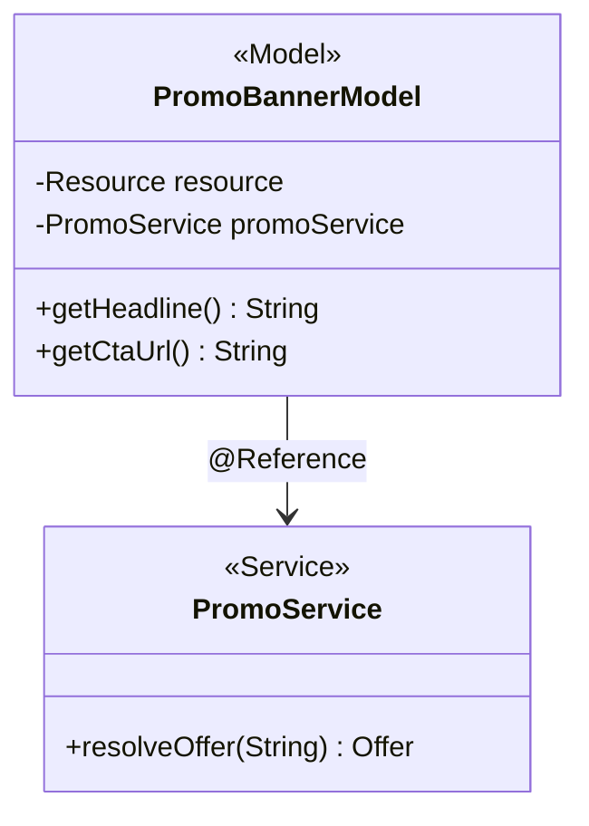

# LLD authoring guide — AEM (AEMaaCS + AMS)

## Purpose framing

An AEM LLD establishes **per-component internals**: Sling Model injection
graph, OSGi service references and cardinality, servlet resource-type
binding, and the JCR-node contract a component reads/writes. It pins the
**HTL context**, the **cache-key contribution**, and the **test harness**
(AEM Mocks, Sling Mocks, MockMvc for admin).

## Typical component types + when to LLD each

- **Sling Model** — inject strategy (`OPTIONAL` vs `REQUIRED`), adapter
  target (`Resource` vs `SlingHttpServletRequest`), `@PostConstruct` wiring,
  HTL-consumed properties, cache-safety of derived data.
- **OSGi service** — `@Component` scope (singleton default), `@Reference`
  cardinality (`MANDATORY_UNARY` vs `OPTIONAL_MULTIPLE`), `@Designate`
  config binding, lifecycle (`@Activate` / `@Deactivate`).
- **Sling servlet** — binding (`resourceType` + `methods` + `extensions` +
  `selectors`), auth requirement, response content-type, cache header
  contribution, error mapping.
- **Sling filter** — `@SlingServletFilter` scope + `pattern`, chain order,
  request-mutation side effects.
- **Sling job / scheduled job** — topic name, event props schema, retry +
  DLQ behavior, idempotency key strategy.
- **Workflow step** — `WorkflowProcess` interface, MetaDataMap contract,
  branch outcomes.
- **HTL template + `cq:dialog`** — data-sly-use bindings, dialog fields
  (`granite/ui/components/coral/foundation/*`), policy attributes.
- **Content Fragment model** — field list, validation, headless GraphQL
  fragment shape.

## Class / module diagram shape for AEM

Java stacks — Mermaid `classDiagram` showing Sling Model class, injected
dependencies (`ResourceResolver`, adapted `Resource`, referenced OSGi
services), and the interface it exports (used by HTL via
`data-sly-use.model`). Include DI arrows and stereotype `<<Model>>` /
`<<Service>>` / `<<Servlet>>`.

## API surface template for AEM

For a Sling Model, table columns: `Getter | Return | HTL binding | Nullable`.
For a Sling servlet, columns: `Selector.extension | HTTP method | Auth |
Response type | Status codes`. For an OSGi service interface, list
methods with parameter and return types; call out `@ProviderType` vs
`@ConsumerType` per Adobe API-versioning rules. <!-- verify -->

## Data-model shape per AEM

Represent as a **JCR-node tree**: `sling:resourceType`, primary type
(`nt:unstructured` / `cq:Component`), property names + types
(`String[]`, `Boolean`, `Long`), child-node structure (e.g. multifield
items under `./items/*`). Include the CF model JSON if the component
consumes Content Fragments. Note replication scope: `/apps` vs `/conf` vs
`/content`.

## Sequence-diagram conventions

Mermaid `sequenceDiagram` participants: `Browser`, `CDN`, `Dispatcher`,
`Publish`, `Author`, `ExternalAPI`. Show:

- **Happy path** — request → dispatcher (miss) → publish (Sling Model
  renders HTL) → cached response.
- **Error path 1 — auth failure** — Closed User Group denies; publish
  returns 403; dispatcher does not cache; error page selected via
  `sling:errorHandler`.
- **Error path 2 — Sling exception** — model throws; error handler
  returns 500 with generic body; log written to `error.log`; alert fires.

## Error handling patterns per AEM

- Map `SlingException`, `RepositoryException`, `LoginException` to
  HTTP status via `sling:errorHandler` scripts.
- Graceful degradation for missing Content Fragment — return placeholder
  markup, log `WARN`, never 500.
- HTL `data-sly-test` guards for null model properties; never emit `null`
  strings.
- Sling Job retry: default 10 attempts with exponential backoff;
  poison-message → DLQ topic. <!-- verify: current default -->
- Dispatcher cache-header discipline: never `Cache-Control: no-store` on
  publish unless the response is user-scoped; use `Dispatcher: no-cache`
  header instead to skip cache without polluting CDN.
- Fail-open for personalization enrichment; fail-closed for auth checks.

## Observability per AEM

- **Metrics** — Sling Metrics (`org.apache.sling.commons.metrics.MetricsService`)
  counters/histograms; expose via JMX; Cloud Manager scrapes for quality
  gates.
- **Logs** — `SLF4J` structured pattern; Cloud Log Forwarder ships to
  Splunk on AEMaaCS; AMS writes `error.log` / `request.log` under
  `crx-quickstart/logs/`.
- **Traces** — OTEL SDK via custom OSGi bundle (bring-your-own on
  AEMaaCS); Cloud Manager surfaces basic traces only.
- **Alerts** — replication lag > 60s, `customer.critical` regression,
  publish p95 > 800ms, dispatcher hit-ratio < 90%.

## Test approach per AEM

- **Unit** — JUnit 5 + `io.wcm.testing.mock.aem.junit5.AemContextExtension`
  (AEM Mocks); resource-tree fixtures under `src/test/resources/`.
- **OSGi services** — Sling Mocks (`OsgiContext`), simulate
  `@Reference` injection.
- **Admin servlets** — Spring MockMvc or Sling `MockSlingHttpServletRequest`.
- **Integration** — AEM ITs via `test-container` module in Cloud Manager;
  Selenium/Playwright for authoring UX.
- Coverage target: 80% line, 60% branch on business components.
  <!-- verify: Cloud Manager threshold -->

## Configuration + feature flags per AEM

- **OSGi config** — `@ObjectClassDefinition` interface with `@AttributeDefinition`;
  bind via `@Designate`; ship configs under
  `ui.config/src/main/content/jcr_root/apps/<proj>/osgiconfig/config.<runmode>/`.
- **Cloud Manager env vars** — `$[env:VAR]` and `$[secret:VAR]` placeholders;
  set in Cloud Manager UI per env.
- **Feature flags** — OSGi toggle service; LaunchDarkly SDK when approved;
  never gate on `runmode` for consumer-facing behavior.

## Deployment considerations per AEM

- Cloud Manager pipeline: build (Maven) → code-quality → security → perf
  test (on stage) → deploy.
- Package deploy order: `ui.apps` (immutable) before `ui.content` (mutable);
  `ui.config` scoped per run-mode.
- Blue/green not native — Adobe manages tier updates; use feature flags
  for progressive delivery.
- Rollback: Cloud Manager one-click; content changes captured via
  package snapshot pre-deploy.

## 2 worked LLD outline examples for AEM

**LLD-AEM-01: PromoBannerModel (Sling Model)**
- Type: Sling Model, adapts `SlingHttpServletRequest`.
- Injects: current `Resource`, `PromoService` (`@Reference`), `Page`
  (from `resource.adaptTo(Page.class)`).
- API: `getHeadline()`, `getCtaUrl()`, `getExpiry()` — all `@Nullable`,
  HTL guards required.
- Sequence: request → HTL binds model → model calls PromoService →
  service reads CF via `ResourceResolver` → returns.
- Errors: null offer → return empty banner; service exception → log +
  return empty.
- Tests: AEM Mocks fixture with sample CF; mock PromoService via
  `@Mock`.

**LLD-AEM-02: PromoInvalidationServlet (`/bin/promo/invalidate`)**
- Type: Sling servlet, POST only, `resourceTypes = "acme/servlets/promo"`.
- Auth: requires `admin` group; enforced by servlet + Sling Referrer
  Filter.
- Contract: `{promoId}` body → `204` on success, `404` if unknown, `403`
  if unauth.
- Errors: never leak stack trace; log full trace at ERROR with
  correlation id.
- Tests: `SlingContext` + `MockSlingHttpServletRequest`.

## Anti-patterns to avoid for AEM

- Injecting full `Session` into a Sling Model — always adapt from
  `ResourceResolver`.
- Skipping `@PostConstruct` null-safety on `@OSGiService` references
  when cardinality is `OPTIONAL`.
- Blocking I/O inside `Sling Model` getters called from HTL — HTL is on
  the render thread; move to service + cache.
- Custom `AuthenticationHandler` on AEMaaCS — collides with IMS chain.
- Long synchronous work in servlets — offload to Sling Jobs.

---

Generate the full LLD using `templates/LLD.md` as master, populating
placeholders with stack-appropriate content from the guide above.
Cross-reference the HLD (`resources/hld-templates/aem.md`) for
parent-context.
