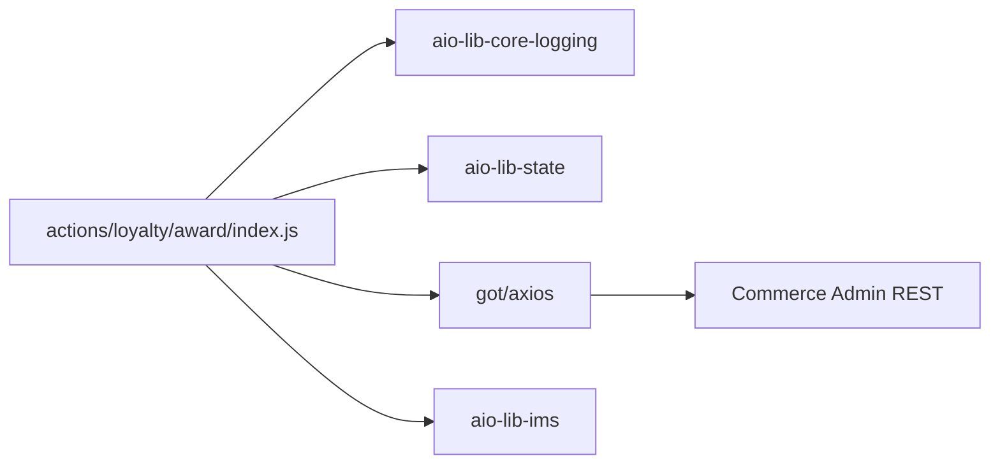

# LLD authoring guide — Adobe App Builder

## Purpose framing

An App Builder LLD establishes **serverless-action internals**:
`main(params)` contract, input validation, secret access, State/Files
usage, event-handler subscription, and API Mesh handler shape. It pins
the **retry semantics**, the **cold-start budget**, and the **auth
boundary** (IMS S2S vs OAuth Server-to-Server vs App Builder user
context).

## Typical component types + when to LLD each

- **Runtime action** — `main(params): Response`; sync (blocking) vs
  async (fire-and-forget with callback); memory + timeout config.
- **Sequence** — ordered pipeline of actions in
  `app.config.yaml`; error propagation.
- **Web action** — public HTTP endpoint (`web: yes`); auth header (`require-adobe-auth`
  or custom).
- **Event handler action** — subscribed via
  `hooks/register-events`; consumes I/O Events (Commerce, AEM Assets,
  IMS Log, Custom Event Provider).
- **API Mesh handler / resolver** — GraphQL type/resolver in Mesh
  config; upstream data sources.
- **UI SPA action** — React app under `web-src/`; served from CDN via
  `aio app deploy`.
- **State access** — `@adobe/aio-lib-state` key/value with TTL.
- **Files access** — `@adobe/aio-lib-files` S3-backed blob store.

## Class / module diagram shape for App Builder

JS module dep graph (Mermaid `flowchart`) showing action file, imported
Adobe libs, and outbound edges (State, Files, Commerce Admin, third
party).

## API surface template for App Builder

- **Web action** — table columns: `Path | Method | Auth | Params schema |
  Response schema | Timeout | Memory`.
- **Event handler** — table columns: `Event type | Provider | Payload
  schema | Idempotency key | Retry policy`.
- **API Mesh resolver** — table columns: `Field | Args | Return | Source |
  Cache TTL`.

## Data-model shape per App Builder

- **State SDK** — key naming (`namespace/entity/id`), value schema (JSON),
  TTL policy (default 1 day, max 365 days). <!-- verify: current limits -->
- **Files SDK** — path convention (`org/app/file`), presigned URL TTL.
- **No relational DB** — for structured data, call external DB via
  action; do **not** try to model persistence inside Runtime.
- **Event payload** — cloudevents 1.0 envelope; document `data` schema
  per event type.

## Sequence-diagram conventions

Participants: `Trigger (Event / HTTP)`, `I/O Runtime`, `Action`,
`State`, `Files`, `IMS`, `External API`. Show:

- **Happy path** — event fires → Runtime dispatches action → action
  fetches IMS token → calls Commerce → writes State → returns 200.
- **Error 1 — auth failure** — IMS token call 401 → action returns
  `{statusCode: 401}`; Runtime does not retry web actions on 4xx.
- **Error 2 — poison event** — event handler throws after max retries
  → Runtime routes to Journaling API for DLQ inspection.

## Error handling patterns per App Builder

- Return `{statusCode, body, headers}` from web actions; **never** throw
  (Runtime translates uncaught throw to 500 with generic body).
- Event handlers: retryable errors → throw; Runtime retries with
  exponential backoff (default 24h window <!-- verify -->); non-retryable
  → catch + return success + log.
- Idempotency: dedupe on event `id` + `type` using State SDK.
- Cold-start budget: keep bundle < 20MB, minimize deep imports;
  measure with `aio rt activation get`.
- Secret access via `params.__ow_headers` or default params — never
  log; use `@adobe/aio-lib-core-logging` mask.
- Fail-open on enrichment (personalization); fail-closed on payment or
  identity flows.

## Observability per App Builder

- **Logs** — `@adobe/aio-lib-core-logging` (structured); shipped to
  Runtime activation logs; view via `aio rt activation logs <id>`.
- **Metrics** — Adobe Developer Console App Metrics dashboard
  (invocation, duration, error count).
- **Traces** — no built-in distributed trace; propagate `traceparent`
  manually via headers.
- **Alerts** — Adobe Developer Console alert rules on error-rate,
  latency, quota.
- **Journaling** — I/O Events Journaling API for event replay + audit.

## Test approach per App Builder

- **Unit** — Jest with `@adobe/aio-lib-*` mocked;
  `@adobe/aio-lib-test-utils` for scaffolding. <!-- verify: package -->
- **Action-level** — `aio app test`; runs against local emulator.
- **Integration** — deploy to dev workspace + hit web action via
  Playwright / supertest.
- **Contract** — WireMock or MSW for upstream Adobe APIs.
- Coverage target: 80% on action business logic.

## Configuration + feature flags per App Builder

- **`app.config.yaml`** — action definitions, memory, timeout, inputs,
  annotations.
- **`.env`** — non-secret env (checked into repo? `.env` is gitignored;
  use `.env.example`).
- **`--param-file`** at deploy time — pass secrets from CI env.
- **I/O Runtime parameters** — set per-action; not editable at runtime
  without redeploy.
- **Feature flags** — LaunchDarkly server SDK inside action; init once
  per cold start.

## Deployment considerations per App Builder

- **Namespace-scoped** — each workspace = one Runtime namespace.
- **`aio app deploy`** — deploys UI + actions atomically.
- **Environments** — Stage vs Production workspaces per project.
- **No blue/green native** — use API Mesh routing or feature flags for
  progressive rollout.
- **Rollback** — redeploy previous git ref; actions replace atomically.

## 2 worked LLD outline examples for App Builder

**LLD-AB-01: loyalty/award (Runtime action)**
- Type: web action, POST, requires Adobe auth.
- Params: `{customerId, points, orderId}`.
- Flow: validate → IMS token → Commerce Admin POST → State write
  (dedupe key) → 200.
- Errors: 400 on invalid; 401 on auth; 503 on Commerce down; 200 with
  `{deduped: true}` on replay.
- Tests: Jest with mocked libs; integration on dev workspace.

**LLD-AB-02: order.completed handler (event action)**
- Type: event handler, subscribed to
  `com.adobe.commerce.observer.sales_order_place_after`.
- Idempotency: State key `order:{orderId}:awarded` with 90d TTL.
- Flow: parse cloudevent → check State → invoke loyalty/award via
  Runtime API → mark State.
- Errors: transient → throw (Runtime retries); non-retryable (missing
  orderId) → log + return success.
- Tests: Jest with fake event payload.

## Anti-patterns to avoid for App Builder

- Long-running sync actions (> 60s) — Runtime kills them; use async
  with callback.
- Logging `params` object — leaks secrets and PII.
- Sharing state across invocations via module-level variables — cold
  starts reset; wrong assumption.
- Deep-imports from `@adobe/aio-*` (e.g. dist internals) — breaks on
  minor upgrade.
- Skipping event dedupe — I/O Events guarantees at-least-once, not
  exactly-once.

---

Generate the full LLD using `templates/LLD.md` as master, populating
placeholders with stack-appropriate content from the guide above.
Cross-reference the HLD (`resources/hld-templates/app-builder.md`) for
parent-context.
