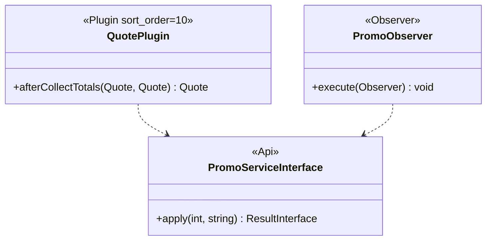

# LLD authoring guide — Adobe Commerce PaaS (Magento)

## Purpose framing

A Commerce PaaS LLD establishes **module internals**: `di.xml` preference
chain, plugin `sort_order`, observer event contract, DTO `data
interface`, and repository/collection query shape. It pins the **admin
ACL scope**, the **caching layer** (varnish + full-page cache + block
cache), and the **PCI boundary** for any code touching the checkout flow.

## Typical component types + when to LLD each

- **Module** — `registration.php`, `module.xml` sequence + version;
  `etc/di.xml` preferences; `composer.json` metapackage deps.
- **Plugin (Interceptor)** — before / around / after; `sort_order`; target
  method contract impact; disable rules (`disabled="true"` in child scope).
- **Observer** — event name (`event_name`), `\Magento\Framework\Event\ObserverInterface`
  contract, sync-vs-async execution, exception swallowing rule.
- **GraphQL resolver** — `schema.graphqls` field def, `Resolver` PHP class,
  `ContextInterface` scope, batch resolver (`BatchResolverInterface`) to
  fix N+1.
- **REST/SOAP Web API** — `webapi.xml` route + ACL + service-contract; DTO
  `data interface` in `Api/Data/`.
- **Controller / action** — front vs admin; `execute()`
  return type (`ResultInterface`); form-key validation.
- **UI Component (admin form/grid)** — `view/adminhtml/ui_component/*.xml`;
  data provider PHP class.
- **Cron job** — `crontab.xml` schedule; group; `\Magento\Cron\Model\ScheduleFactory`
  contract; overlap guard.

## Class / module diagram shape for Commerce PaaS

PlantUML class diagram with namespaces; highlight `di.xml` `preference`
lines and plugin `sort_order` on association labels. Show:

## API surface template for Commerce PaaS

- **Plugin** — table columns: `Target class::method | Type
  (before/around/after) | sort_order | Signature | Reason`.
- **Observer** — table columns: `Event | Area (frontend/adminhtml/global)
  | Handler class | Sync/async | Failure mode`.
- **Web API** — table columns: `Route | Method | Service contract | ACL |
  Success DTO | Error codes`.
- **GraphQL** — table columns: `Field | Args | Return type | Resolver
  class | Cache identity`.

## Data-model shape per Commerce PaaS

- **EAV attribute** — `data_patch` (`InstallData` deprecated
  <!-- verify -->) or `db_schema.xml` for flat columns.
- **`db_schema.xml`** — declarative: table name, columns, indexes, FKs,
  disabled indexes; `db_schema_whitelist.json` for delta control.
- **Extension attribute** — `extension_attributes.xml` for adding fields
  to Magento core DTOs without inheritance.
- **Repository pattern** — `Repository` + `SearchCriteria` + `Collection`;
  never `ObjectManager::get` in class bodies.

## Sequence-diagram conventions

Participants: `Storefront`, `Fastly`, `Origin (Nginx+PHP-FPM)`, `Mysql`,
`Redis`, `RabbitMQ`, `PaymentGateway`. Show:

- **Happy path** — storefront request → Fastly (miss) → controller →
  plugin chain → service → repository (mysql) → block cache write →
  response.
- **Error path 1 — cart validation fail** — controller catches
  `LocalizedException`, returns redirect with error message; no cache
  poisoning.
- **Error path 2 — payment decline** — gateway returns declined; observer
  rolls back reservation; `sales_order_place_failed` event fires; DLQ
  consumer notifies ops.

## Error handling patterns per Commerce PaaS

- Throw `\Magento\Framework\Exception\LocalizedException` for
  user-facing; `NoSuchEntityException` for 404; `AuthorizationException`
  for 403.
- Web API auto-maps these to HTTP status codes; never let
  `\Exception` leak (returns 500 with verbose trace in developer mode).
- Consumer (queue) idempotency: use message id + reservations table.
- Observer errors: **never** swallow silently in
  `sales_order_place_before` chain — it can corrupt orders.
- Fail-open on personalization; fail-closed on inventory reservation.
- Circuit breaker via `\Magento\Framework\HTTP\ClientInterface` wrapper
  + Redis counter.

## Observability per Commerce PaaS

- **Logs** — `\Psr\Log\LoggerInterface` injected; New Relic PHP agent
  ships to APM; `bin/magento setup:config:set --enable-debug-logging=false`
  in prod.
- **Metrics** — New Relic custom metrics; `\Magento\Framework\Profiler`
  spans in dev only.
- **Traces** — New Relic distributed tracing with `NEWRELIC_APP_NAME`
  per env; OpenTelemetry auto-instrumentation via `otel-php` extension.
  <!-- verify: currently supported -->
- **Alerts** — indexer stuck > 15 min, RabbitMQ backlog > 1000, checkout
  error-rate > 1%, Fastly hit-ratio < 80%.

## Test approach per Commerce PaaS

- **Unit** — PHPUnit 9+ under `dev/tests/unit/`; `ObjectManagerHelper`
  for constructor injection; mock only interfaces.
- **Integration** — `dev/tests/integration/`; requires DB fixture;
  `@magentoDataFixture` annotations.
- **API functional** — `dev/tests/api-functional/`; Web API round-trip.
- **MFTF** — `dev/tests/acceptance/`; declarative XML tests; run in
  Selenium.
- Coverage: 70% unit on module classes. <!-- verify -->

## Configuration + feature flags per Commerce PaaS

- **`env.php`** — DB, cache, queue, session config; **never** commit.
- **`config.php`** — modules enabled + scope config; commit.
- **`system.xml` + `config.xml`** — admin-editable config; scope
  (default/website/store).
- **Feature flags** — `\Magento\Framework\App\DeploymentConfig` toggles
  or Split.io / LaunchDarkly SDK; avoid `Mage::getStoreConfig` legacy.
- Adobe Commerce Cloud env vars via `.magento.env.yaml`.

## Deployment considerations per Commerce PaaS

- **Build phase** — `composer install --no-dev`, `setup:di:compile`,
  `setup:static-content:deploy`.
- **Deploy phase** — `setup:upgrade` (runs data + schema patches),
  `cache:flush`, `queue:consumers:restart`.
- Order matters: schema before data patches; ZDT deploys require
  compatible schema.
- Adobe Commerce Cloud: `.magento.app.yaml` hooks orchestrate; do not
  edit at runtime.

## 2 worked LLD outline examples for Commerce PaaS

**LLD-CPAAS-01: LoyaltyDiscountPlugin**
- Type: Plugin, `sort_order=100`, on
  `Magento\Quote\Model\Quote::collectTotals`.
- Method: `afterCollectTotals(Quote $subject, Quote $result): Quote`.
- Deps: `LoyaltyServiceInterface` (via constructor).
- Errors: on service timeout, log + skip (fail-open); do not throw.
- Tests: PHPUnit with mocked service + Quote fixture.

**LLD-CPAAS-02: LoyaltyPointsConsumer (queue)**
- Type: consumer bound to topic `acme.loyalty.award`.
- Contract: `AwardMessage { customerId, points, orderId, idempotencyKey }`.
- Idempotency: `loyalty_award` table PK on `idempotencyKey`.
- Errors: transient → nack for retry (max 5, backoff); poison → DLQ topic
  `acme.loyalty.award.dlq`.
- Tests: integration with queue fixture.

## Anti-patterns to avoid for Commerce PaaS

- `ObjectManager::get()` in class bodies — breaks DI, blocks tests.
- Skipping `sort_order` on plugins — brittle chain ordering.
- Direct SQL via `getConnection()->query()` — bypasses declarative
  schema; use repositories/collections.
- Observer swallowing exception on `sales_order_place_after` — orphan
  reservations.
- Full-page cache on personalized content without ESI — leaks PII.

---

Generate the full LLD using `templates/LLD.md` as master, populating
placeholders with stack-appropriate content from the guide above.
Cross-reference the HLD (`resources/hld-templates/commerce-paas.md`) for
parent-context.
