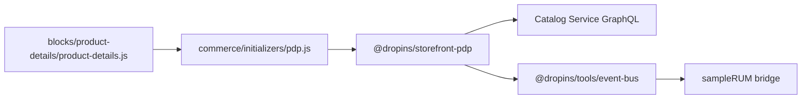

# LLD authoring guide — EDS + Commerce hybrid

## Purpose framing

An EDS + Commerce LLD establishes **drop-in-block internals**: how an
EDS block hosts a Commerce drop-in, initializer wiring, event-bus
bridging between EDS RUM and drop-in telemetry, and cross-origin config
(EDS sheet → drop-in config). It pins the **LCP budget on commerce
pages** (PDP hero, PLP first tile) and the **drop-in-version pin**.

## Typical component types + when to LLD each

- **Drop-in-hosting block** — EDS block that mounts a drop-in (Cart,
  Checkout, PDP, MiniCart); loads drop-in bundle, calls initializer,
  provides root DOM node.
- **Drop-in extension block** — EDS block that adds a slot handler to an
  already-mounted drop-in (e.g. loyalty tile in cart).
- **Initializer script** — global bootstrap in `scripts.js` /
  `commerce.js`; sets endpoints, view codes, event listeners.
- **Auto-block for PDP/PLP** — URL-pattern-driven; injects drop-in
  block based on URL shape (`/products/*`, `/category/*`).
- **Event bridge** — subscribes `@dropins/tools/event-bus`; forwards to
  EDS `sampleRUM`.
- **Custom checkout step** — drop-in slot handler + backend call.
- **Config sheet** — Commerce env config (endpoint, store code, view
  code) via EDS sheet.

## Class / module diagram shape for EDS + Commerce

Mermaid `flowchart` showing EDS block → drop-in package → Catalog
Service / Commerce; annotate initializer boundary.

## API surface template for EDS + Commerce

- **Drop-in-hosting block** — `decorate(block)` contract + drop-in
  props (sku, view-code, endpoint).
- **Extension block** — table columns: `Target drop-in | Slot | Position
  | Handler | Props`.
- **Config sheet** — column schema: `endpoint`, `store-code`,
  `view-code`, `env-label`.
- **Event bridge** — table columns: `Drop-in event | RUM checkpoint |
  Sampled?`.

## Data-model shape per EDS + Commerce

- **Catalog Service** — fields consumed per block; identify custom
  attributes used.
- **Client state** — drop-in `event-bus` topics (`cart/updated`,
  `checkout/complete`); do not duplicate in EDS module scope.
- **URL contract** — `/products/{urlKey}` → drop-in reads urlKey from
  URL, resolves SKU via Catalog.
- **Config sheet schema** — one row per env; block reads by hostname
  match.

## Sequence-diagram conventions

Participants: `Browser`, `EDS Edge`, `Block`, `Drop-in`, `Catalog Svc`,
`Commerce Admin`. Show:

- **Happy path — PDP** — request → edge → HTML → block loads → mounts
  drop-in → drop-in fetches Catalog → renders.
- **Error 1 — Catalog Service 502** — drop-in surfaces error state;
  block emits RUM `pdp-catalog-error`; user sees retry CTA.
- **Error 2 — add-to-cart failure** — drop-in emits `cart/error`;
  bridge forwards to RUM; user sees inline toast.

## Error handling patterns per EDS + Commerce

- Drop-in error handlers: pass via initializer config; log + RUM;
  never `alert()`.
- Catalog Service partial: render available fields; log missing.
- Cart mutation retry: drop-in handles idempotency; block does not
  retry.
- Price / inventory: always fail-closed (do not display stale).
- Recommendations / badges: fail-open (silent hide).
- Network timeout: 5s for GraphQL; block shows skeleton state.

## Observability per EDS + Commerce

- **RUM** — EDS `sampleRUM` for CWV + navigation; custom checkpoints
  for commerce events (`add-to-cart`, `checkout-complete`).
- **Drop-in telemetry** — `@dropins/tools/logger`; ship via bridge to
  RUM or Adobe Analytics.
- **Commerce backend** — Catalog Service + Live Search have Adobe-
  managed dashboards; customer sees availability.
- **Alerts** — LCP on PDP > 2.5s, cart-error rate > 0.5%, checkout drop
  vs baseline.

## Test approach per EDS + Commerce

- **Unit** — Vitest + jsdom for block logic; mock drop-in via
  `@dropins/testing`. <!-- verify: package -->
- **Integration** — Playwright against `hlx up` + sandbox Catalog
  Service.
- **Contract** — MSW for GraphQL responses.
- **Lighthouse CI** — commerce page budgets: LCP ≤ 2.5s, TBT ≤ 200ms.
- **Visual** — Percy for PDP/PLP snapshots per drop-in version.

## Configuration + feature flags per EDS + Commerce

- **Sheet-based** — `configs.json` with tab per env (dev / stage /
  prod); block reads via hostname.
- **Drop-in version** — `package.json` exact pin; upgrade via PR + 24h
  soak.
- **Meta tags** — `<meta name="commerce-endpoint">` per page override.
- **Feature flags** — LaunchDarkly client SDK; block-level gating for
  drop-in migrations (old → new checkout).

## Deployment considerations per EDS + Commerce

- **EDS side** — git push → `.aem.live` publish; instant rollback via
  revert.
- **Drop-in bundle** — served from Adobe CDN or bundled via EDS build;
  version-lock in prod.
- **Commerce backend** — indexer + Catalog sync are backend concerns;
  changes take minutes to reflect.
- **Coordinated rollout** — when Commerce API contract changes, ship
  drop-in upgrade + block change in same PR to avoid contract drift.

## 2 worked LLD outline examples for EDS + Commerce

**LLD-EDSC-01: ProductDetailsBlock (PDP)**
- Type: EDS block hosting `@dropins/storefront-pdp`.
- Contract: reads urlKey from URL, passes to drop-in initializer.
- Deps: `initializers/pdp.js`, Catalog Service.
- Errors: Catalog 4xx → render 404 state; 5xx → retry-once + error
  state.
- RUM: `pdp-loaded`, `add-to-cart`, `pdp-catalog-error`.
- Tests: Playwright PDP + Lighthouse budget.

**LLD-EDSC-02: LoyaltyCartExtensionBlock**
- Type: EDS block registering drop-in extension slot.
- Slot: `Cart.Summary`, position `after`.
- Contract: subscribes `cart/updated`, calls loyalty API for points
  preview, renders row.
- Errors: loyalty API fail → hide row (fail-open); log to RUM.
- Tests: Vitest with mocked event-bus; Playwright cart flow.

## Anti-patterns to avoid for EDS + Commerce

- Awaiting drop-in mount in `loadEager` — kills LCP; mount in
  `loadLazy`.
- Duplicating drop-in state in EDS module scope — sources of truth
  diverge.
- Bypassing drop-in for cart mutations (raw fetch to Commerce Admin) —
  breaks drop-in state consistency.
- Skipping version pin on drop-ins — non-deterministic behavior across
  deploys.
- Rendering price from Live Search doc without confirming at cart —
  price drift.

---

Generate the full LLD using `templates/LLD.md` as master, populating
placeholders with stack-appropriate content from the guide above.
Cross-reference the HLD (`resources/hld-templates/eds-commerce.md`) for
parent-context.
