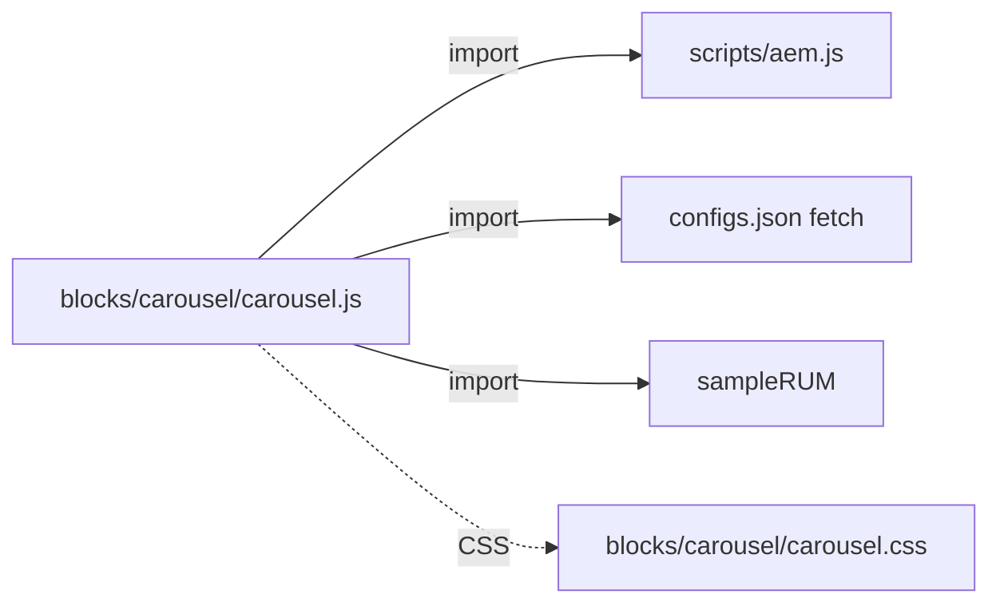

# LLD authoring guide — Edge Delivery Services (EDS)

## Purpose framing

An EDS LLD establishes **block internals** and **decoration phases**:
`loadEager` vs `loadLazy` vs `loadDelayed`, the block's DOM contract,
auto-block trigger, and how sheet-based config is consumed. It pins the
**LCP contribution budget**, the **CSS scope**, and the **RUM
instrumentation**.

## Typical component types + when to LLD each

- **Block** — `blocks/<name>/<name>.js` + `<name>.css`; exported
  `decorate(block)`; DOM manipulation contract.
- **Auto-block** — regex/URL pattern trigger in `scripts.js`; transforms
  raw markdown DOM into a block instance before `decorate`.
- **Section decoration** — cross-block DOM shaping in `scripts.js`;
  runs after all blocks in a section load.
- **Fragment** — reusable authored fragment referenced by link; loaded
  via `loadFragment()`.
- **Sheet-based config** — `configs.json` / `nav.json` / `footer.json`;
  fetched at eager phase; used to drive block behavior.
- **Placeholders** — `placeholders.json` for i18n strings.
- **Metadata** — `<meta>` tags surfaced from Word/GDocs; consumed by
  blocks + head.
- **Instrumentation** — `RUM` sampling, `sendCoveredError()`, custom
  checkpoints.

## Class / module diagram shape for EDS

JS module dep graph (Mermaid `flowchart`) showing block file, imported
helpers from `scripts/aem.js` / `scripts/scripts.js`, and RUM hooks.

## API surface template for EDS

- **Block** — `decorate(block: HTMLElement): void | Promise<void>`.
  Describe DOM structure it consumes (rows/cols from markdown), classes
  it emits, `aria-*` attributes.
- **Auto-block** — trigger regex + resulting block shape.
- **Fragment** — link href pattern + loading strategy.
- **Config sheet** — column schema per sheet tab; how block reads it.

## Data-model shape per EDS

- **Content source** — Word / Google Docs / SharePoint / drive.google.com;
  path mirrors URL.
- **Block config** — first row/cell keys, remaining rows values (key-
  value table pattern).
- **Sheet** — tab per config type; columns are typed by header (bool,
  number, url, string).
- **Metadata** — `<meta name="foo" content="bar">` emitted from
  authored `Metadata` block.
- **No server persistence** — EDS is git + published-content-source only.

## Sequence-diagram conventions

Participants: `Browser`, `EDS Edge (helix-worker)`, `Content Bus`,
`Block loader`, `Block`. Show:

- **Happy path (eager)** — request → edge fetches HTML from Content
  Bus → returns HTML → browser parses → `loadEager` runs → LCP block
  decorates → hero paints.
- **Error 1 — block load failure** — dynamic import fails → block
  container gets `.block-failed`; error logged via `sampleRUM`; page
  continues.
- **Error 2 — missing config sheet** — `fetch(configs.json)` 404 →
  block falls back to defaults; console warn; RUM error checkpoint.

## Error handling patterns per EDS

- `try/catch` around `decorate()` bodies; on failure add
  `.block-failed` class + `sampleRUM('error', {...})`; never throw
  uncaught (breaks other blocks).
- Missing config: fall back to hardcoded defaults; do not block render.
- Network fetch: `AbortController` with 3s timeout; retry once for
  idempotent GET.
- Fail-open for optional enrichments (auto-blocks, personalization);
  fail-closed for consent / privacy (block until consent).
- Never `console.error` in prod paths without also emitting to RUM.
- Silent-skip for blocks that require missing sheets; documented in
  authoring guide.

## Observability per EDS

- **RUM** — `sampleRUM(checkpoint, data)`; ships to
  `rum.hlx.page`; downstream to Adobe RUM Explorer.
- **Web Vitals** — auto-captured (LCP, INP, CLS); custom checkpoints
  via `sampleRUM('cwv-lcp', ...)`.
- **Errors** — `window.addEventListener('error')` + `unhandledrejection`
  → RUM.
- **Alerts** — CWV regression via RUM Explorer alerts; 404 spike via
  edge logs.

## Test approach per EDS

- **Unit** — Vitest + jsdom for pure logic; import block directly.
- **E2E** — Playwright against `hlx up` local dev; run on preview URL
  in CI.
- **Visual regression** — Percy or Chromatic on preview.
- **Lighthouse CI** — LCP/INP/CLS budgets enforced per PR.
- Coverage target: 60% on block JS; visual + Lighthouse cover the rest.

## Configuration + feature flags per EDS

- **Sheet-based** — `configs.json` tabs (per environment via query
  param `?config=stage`).
- **Meta tags** — per-page overrides via authored Metadata block.
- **Feature flags** — sheet column + block-level check; LaunchDarkly
  client SDK for gated rollout of full blocks.
- **Env** — `helix-config.yaml` in git; `.env` for `hlx` CLI dev only.

## Deployment considerations per EDS

- **Git-based** — merge to `main` → auto-published to `.aem.live`.
- **Preview** — every branch has `<branch>--<repo>--<owner>.aem.page`.
- **Instant rollback** — revert commit; edge invalidates on push.
- **CDN purge** — `hlx cache invalidate`; usually automatic.
- **No build step** for JS/CSS by default (raw ES modules served); can
  add a build via `.helix/build.yml`.

## 2 worked LLD outline examples for EDS

**LLD-EDS-01: Carousel block**
- Type: block, section-level.
- Contract: reads rows as slides (col0 = image, col1 = caption);
  emits `<ul>` with slides + prev/next buttons.
- Deps: `sampleRUM` for CTA click checkpoint.
- Phase: `loadLazy` (below fold).
- Errors: 0 rows → hide block; image load fail → `alt` text + skip.
- Tests: Vitest snapshot of DOM; Playwright interaction.

**LLD-EDS-02: FormBlock (contact form)**
- Type: block, `loadLazy`; fetches form definition sheet.
- Contract: reads sheet `form.json` → renders fields; POSTs to Adobe
  Forms API.
- Errors: submit 4xx → inline field errors; 5xx → toast + retry once.
- Instrumentation: `sampleRUM('form-submit', {status})`.
- Tests: MSW for POST endpoint; Playwright happy + error path.

## Anti-patterns to avoid for EDS

- Awaiting network in `decorate()` synchronously — blocks other block
  decoration; use lazy or async.
- Heavy JS in `loadEager` — kills LCP; move to `loadLazy` or
  `loadDelayed`.
- Global CSS mutation from block — pollutes other blocks; scope with
  block class prefix.
- Fetching config on every render — cache in-module; sheets are static
  between publishes.
- Skipping `sampleRUM` on errors — invisible in prod; alerts never fire.

---

Generate the full LLD using `templates/LLD.md` as master, populating
placeholders with stack-appropriate content from the guide above.
Cross-reference the HLD (`resources/hld-templates/eds.md`) for
parent-context.
