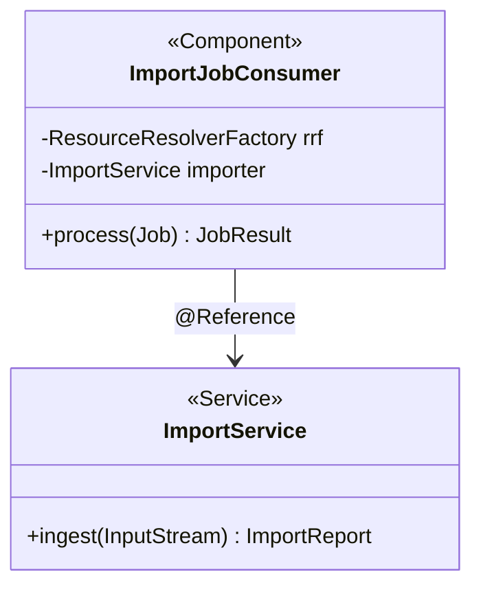

# LLD authoring guide — Sling / Shaft (standalone OSGi)

## Purpose framing

A Sling LLD establishes **bundle internals**: OSGi component activation
sequence, `@Reference` graph, `Sling Job` topic contract, servlet
resource-type binding, and JCR content-tree contract. Same primitives as
AEM but without the WCM/HTL layer — target is a standalone Sling
launchpad, a Sling-based headless service, or Shaft microkernel bundles.

## Typical component types + when to LLD each

- **OSGi component** (`@Component`) — scope (singleton default), service
  interfaces exported, `@Activate` / `@Modified` / `@Deactivate` semantics,
  config via `@Designate`.
- **Sling servlet** — bound by `resourceType` + `methods` + `paths`; auth
  requirement; response content-type.
- **Sling filter** — `@SlingServletFilter` scope (REQUEST / INCLUDE /
  FORWARD / ERROR) + `pattern` + chain order.
- **Sling job consumer** — `JobConsumer` implementation; topic;
  idempotency; retry.
- **Sling scheduled job** — cron expression via `Scheduler.schedule()`
  or config; overlap guard.
- **Sling adapter** — `AdapterFactory` bridging resource → domain type.
- **Sling ResourceProvider** — custom backing store (non-JCR).
- **Sling Model** — same as AEM but framework-agnostic;
  `@Model(adaptables = SlingHttpServletRequest.class)`.

## Class / module diagram shape for Sling

Mermaid `classDiagram` with `<<Component>>` / `<<Service>>` / `<<Servlet>>`
stereotypes; annotate `@Reference` cardinality
(`MANDATORY_UNARY`, `OPTIONAL_MULTIPLE`).

## API surface template for Sling

- **Servlet** — table columns: `resourceType | methods | extensions |
  selectors | Auth | Response | Status codes`.
- **JobConsumer** — table columns: `Topic | Payload schema | Idempotency
  key | Retry policy | DLQ topic`.
- **Service interface** — Java methods with parameter/return types;
  mark `@ProviderType` vs `@ConsumerType` for API compatibility.

## Data-model shape per Sling

- **JCR-node tree** — same as AEM: `sling:resourceType`, primary type,
  properties, child structure.
- **OSGi config** — properties surface via `@AttributeDefinition`.
- **Job payload** — `Map<String,Object>` bag; document schema; validate
  in consumer before work.
- **Custom `ResourceProvider`** — document backing store, resource-tree
  mapping, mutation semantics.

## Sequence-diagram conventions

Participants: `HTTPClient`, `Sling HTTP`, `Filter Chain`, `Servlet`,
`Service`, `JCR`, `JobManager`, `Consumer`. Show:

- **Happy path** — client → filter chain → servlet resolves →
  `resource.adaptTo(Model)` → service → JCR write.
- **Error 1 — auth failure** — filter chain 401; no downstream call.
- **Error 2 — job retry loop** — consumer throws → JobManager increments
  retry count → after N attempts → DLQ topic.

## Error handling patterns per Sling

- Servlet exceptions: catch, log at ERROR with correlation id, return
  structured JSON `{error, code, requestId}`; never leak stack.
- Job retry via `JobResult.FAILED` (retry) vs `CANCEL` (poison, DLQ).
- Idempotency: derive key from payload; store applied-keys in JCR
  or Redis to short-circuit reprocess.
- Circuit breaker for outbound HTTP via Resilience4j (bring-your-own
  bundle).
- Fail-open for cache-warm jobs; fail-closed for identity or billing
  paths.
- Never swallow `LoginException` — indicates ACL / service-user
  misconfig.

## Observability per Sling

- **Metrics** — `org.apache.sling.commons.metrics.MetricsService`;
  Dropwizard or Micrometer bridge for Prometheus scrape.
- **Logs** — SLF4J; JSON pattern via logback-encoder; ship via Filebeat
  to ELK/Splunk.
- **Traces** — OpenTelemetry Java agent as JVM `-javaagent`; propagate
  `traceparent` header through filters.
- **Alerts** — job DLQ depth > 0, servlet p95 > SLO, JCR session leak
  (`ResourceResolver` not closed).

## Test approach per Sling

- **Unit** — JUnit 5 + Sling Mocks (`SlingContext`); mock JCR resource
  tree fixtures in JSON.
- **OSGi** — `OsgiContext` for service registration; `MockOsgi.activate()`
  to drive lifecycle.
- **Integration** — Sling Launchpad IT via `sling-mock-oak` for real
  Oak-backed JCR; slow but faithful.
- **Contract** — Pact for outbound HTTP; schemathesis if servlets expose
  OpenAPI.
- Coverage target: 80% line on business bundles.

## Configuration + feature flags per Sling

- **OSGi config** — `@ObjectClassDefinition` + `@Designate`; ship via
  `install/` folder in bundle or `sling:OsgiConfig` node.
- **Env-scoped** — use `sling.run.modes` framework property; folder
  naming `config.<runmode>/`.
- **Feature flags** — `org.apache.sling.featureflags` API (native);
  toggle via OSGi config.

## Deployment considerations per Sling

- **Bundle install** — via Sling Web Console or `mvn sling:install`;
  ensure bundle-symbolicname is unique.
- **Feature model** (Sling Feature) — declarative bundle + config set;
  `slingfeature-maven-plugin` builds; drop into `.launcher/`.
- **Docker image** — bake feature model into image; run as
  `java -jar org.apache.sling.feature.launcher.jar`.
- **Rolling deploy** — one node at a time; drain JobManager first.

## 2 worked LLD outline examples for Sling

**LLD-SLING-01: FeedIngestJobConsumer**
- Type: `JobConsumer`, topic `acme/feeds/ingest`.
- Deps: `ResourceResolverFactory` (service-user `feed-writer`),
  `FeedParserService`.
- Contract: `{sourceUrl, feedType}`; writes to `/var/feeds/<id>`.
- Errors: parse fail → CANCEL (DLQ `acme/feeds/ingest/dlq`); IO fail →
  FAILED (retry up to 5).
- Idempotency: `sourceUrl + etag` key stored in `/var/feeds/_applied`.
- Tests: Sling Mocks + fixture feeds.

**LLD-SLING-02: HealthCheckServlet (`/system/health.json`)**
- Type: Sling servlet, GET only, no auth.
- Response: `{status: UP|DOWN, checks: [...]}`.
- Wired to `HealthCheckExecutor` service; aggregates all tagged checks.
- Errors: always 200 with body indicating downstream health.
- Tests: unit via `SlingContext`; IT via Launchpad.

## Anti-patterns to avoid for Sling

- Leaking `ResourceResolver` (must close in try-with-resources) —
  session pool exhaustion.
- Long synchronous work in servlets — pins Jetty threads; offload to
  jobs.
- `@Reference` with `MANDATORY_UNARY` on optional services — bundle
  fails to activate silently.
- Storing large binaries as `jcr:data` on `nt:file` at path with hot
  read pattern — bypass CDN.
- Skipping `@Modified` when config supports live-reload — restart-only
  bundle.

---

Generate the full LLD using `templates/LLD.md` as master, populating
placeholders with stack-appropriate content from the guide above.
Cross-reference the HLD (`resources/hld-templates/sling.md`) for
parent-context.
