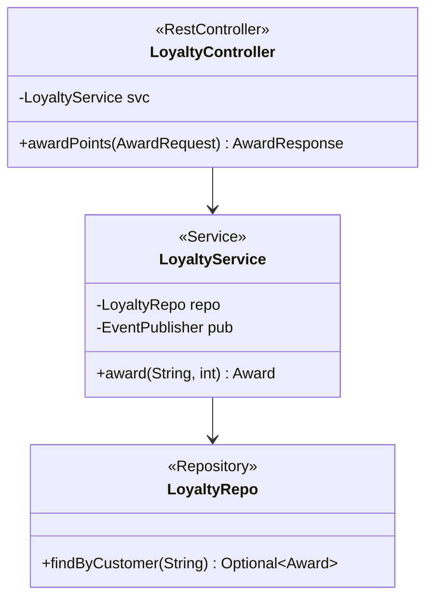

# LLD authoring guide — Spring Boot

## Purpose framing

A Spring Boot LLD establishes **per-component internals**: controller
routes and DTOs, service transaction boundaries, repository query shape,
consumer/producer contracts, and cross-cutting concerns (validation,
error mapping, retry, circuit-breaker). It pins the **package-by-feature**
layout, the **profile-scoped config**, and the **observability spans**.

## Typical component types + when to LLD each

- **REST controller** (`@RestController`) — routes, request/response
  DTOs, `@Valid` groups, error handler mapping, idempotency headers.
- **Service** (`@Service`) — transaction boundary (`@Transactional`
  propagation + isolation), read vs write split, method visibility.
- **Repository** (`@Repository` / JPA / R2DBC / MyBatis) — query
  methods, native SQL where needed, N+1 avoidance (`@EntityGraph`).
- **Kafka/RabbitMQ consumer** (`@KafkaListener`) — topic, group,
  ack-mode, retry topic pattern.
- **Producer** (`KafkaTemplate` / `RabbitTemplate`) — outbox pattern,
  serialization contract.
- **Configuration properties** (`@ConfigurationProperties`) — nested
  binding, validation.
- **Scheduled task** (`@Scheduled`) — cron / fixed-delay; overlap guard;
  ShedLock for HA. <!-- verify: ShedLock recommended -->
- **Web filter / interceptor** — auth, tracing, request-logging.

## Class / module diagram shape for Spring

Mermaid `classDiagram` with `<<RestController>>` / `<<Service>>` /
`<<Repository>>` stereotypes; show `@Autowired` (constructor-injection
preferred) arrows.

## API surface template for Spring

- **REST controller** — table columns: `Path | Method | Request DTO |
  Response DTO | Auth | Status codes | Idempotent?`.
- **Service** — Java method signatures; note `@Transactional` config.
- **Consumer** — table columns: `Topic | Group | Payload schema |
  Ack-mode | Retry topic | DLQ topic`.

## Data-model shape per Spring

- **JPA `@Entity`** — table + column mapping; relationships
  (`@OneToMany fetch = LAZY` default); indexes via `@Table(indexes = ...)`.
- **DDL** — Flyway (`V1__init.sql`) or Liquibase migrations; **never**
  rely on `hibernate.ddl-auto=update` in prod.
- **DTO / Request-Response** — Java records preferred; `@Valid` +
  `@NotBlank`, `@Size`, `@Pattern`, custom validators.
- **ER diagram** in Mermaid `erDiagram` showing entities + PK/FK.

## Sequence-diagram conventions

Participants: `Client`, `Gateway`, `Controller`, `Service`, `Repository`,
`DB`, `Cache`, `Broker`. Show:

- **Happy path** — client → gateway (JWT verified) → controller (@Valid)
  → service (@Transactional) → repo → DB commit → 200.
- **Error 1 — 401 unauthorized** — gateway rejects JWT; no downstream.
- **Error 2 — DB timeout** — repo throws `QueryTimeoutException` →
  service rolls back → `@ControllerAdvice` maps to 503 → circuit-breaker
  opens.

## Error handling patterns per Spring

- Central `@RestControllerAdvice` mapping exceptions to
  `ProblemDetail` (RFC 7807).
- Domain exceptions extend a base; map to HTTP status via `@ResponseStatus`.
- Bean-validation errors: `MethodArgumentNotValidException` → 400 with
  field-level errors.
- Retry: `@Retryable(maxAttempts=3, backoff=@Backoff(delay=200,
  multiplier=2))` from Spring Retry.
- Circuit breaker: Resilience4j
  (`@CircuitBreaker(name = "loyalty", fallbackMethod = "…")`).
- Bulkhead: Resilience4j `@Bulkhead` for outbound call isolation.
- Fail-open for enrichment; fail-closed for authorization + billing.

## Observability per Spring

- **Metrics** — Micrometer with `MeterRegistry`; auto-instrumented HTTP
  server + JVM + JDBC HikariCP.
- **Prometheus / Datadog** — Actuator `/actuator/prometheus`; Datadog
  agent for statsd.
- **Traces** — Micrometer Tracing + OpenTelemetry SDK; propagate
  W3C `traceparent`; span per repo call via `@NewSpan`.
- **Logs** — Logback JSON encoder; MDC keys `traceId`, `spanId`,
  `userId`.
- **Actuator** — `/actuator/health`, `/actuator/info`; secure with
  Spring Security.
- **Alerts** — p95 latency SLO breach, HTTP 5xx > 1%, circuit-breaker
  open, consumer lag > threshold.

## Test approach per Spring

- **Unit** — JUnit 5 + Mockito; test slice `@WebMvcTest` for controller,
  `@DataJpaTest` for repo, `@JsonTest` for DTOs.
- **Integration** — `@SpringBootTest` + Testcontainers (Postgres, Kafka,
  Redis); WireMock for outbound HTTP.
- **Contract** — Spring Cloud Contract (Pact-compatible) provider-side.
- **Non-functional** — Gatling / k6 for load; ArchUnit for architecture
  fitness.
- Coverage target: 80% line, 70% branch on service + controller layers.

## Configuration + feature flags per Spring

- **`application.yml`** with profile overrides
  (`application-prod.yml`); Spring Cloud Config or Kubernetes ConfigMap.
- **Secrets** — never in yaml; Vault / AWS Secrets Manager /
  Kubernetes Secrets.
- **Feature flags** — LaunchDarkly / Unleash SDK; wrap in
  `FeatureToggle` service for testability.
- **`@ConfigurationProperties(prefix="loyalty")`** — bind grouped
  settings; validate on startup.

## Deployment considerations per Spring

- **Container** — Cloud-Native Buildpacks (`spring-boot:build-image`);
  distroless base.
- **Kubernetes** — Helm chart or Kustomize; readiness on
  `/actuator/health/readiness`, liveness on `/liveness`.
- **DB migration** — Flyway runs on startup by default; for zero-
  downtime, decouple migrations via init-container or migration job.
- **Rollout** — rolling / canary via Argo Rollouts or Flagger.
- **Graceful shutdown** — `server.shutdown=graceful`; drain in-flight
  requests before pod termination.

## 2 worked LLD outline examples for Spring

**LLD-SPRING-01: LoyaltyController**
- Type: `@RestController`, path `/api/v1/loyalty`.
- Routes: `POST /award` (idempotent via `Idempotency-Key`),
  `GET /balance/{customerId}`.
- Deps: `LoyaltyService` (constructor).
- Errors: `CustomerNotFound` → 404; validation → 400; downstream fail →
  503 via circuit-breaker fallback.
- Tests: `@WebMvcTest` with mocked service; contract test.

**LLD-SPRING-02: OrderEventConsumer**
- Type: `@KafkaListener(topics="order.completed", groupId="loyalty")`.
- Ack-mode: MANUAL_IMMEDIATE; explicit `ack.acknowledge()`.
- Contract: `OrderCompleted{orderId, customerId, total, ts}`.
- Idempotency: dedupe on `orderId` in Redis with TTL.
- Errors: retry topic `order.completed.retry` (3 attempts) → DLQ
  `order.completed.dlq`.
- Tests: `@SpringBootTest` + Testcontainers Kafka.

## Anti-patterns to avoid for Spring

- Field injection (`@Autowired` on field) — hides deps, breaks tests.
- Business logic in controller — put it in service.
- Shared mutable state in singleton beans — thread-safety bugs.
- `hibernate.ddl-auto=update` in prod — silent schema drift.
- Swallowing exceptions in `@Async` methods — silent failure; wire
  `AsyncUncaughtExceptionHandler`.
- Missing `@Transactional` on write methods — partial writes on failure.

---

Generate the full LLD using `templates/LLD.md` as master, populating
placeholders with stack-appropriate content from the guide above.
Cross-reference the HLD (`resources/hld-templates/spring.md`) for
parent-context.
