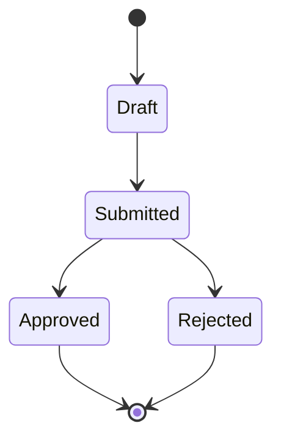

# {{TITLE}} — Low-Level Design

**LLD**

| Field | Value |
|---|---|
| Version | {{VERSION}} |
| Status | {{STATUS}} <!-- Draft \| Reviewed \| Approved --> |
| Author | {{AUTHOR}} |
| Last updated | {{LAST_UPDATED}} |
| Parent HLD | {{PARENT_HLD}} |
| Related ADRs | {{RELATED_ADRS}} |
| Stack | {{STACK}} |
| Role driving | {{ROLE}} |

---

## 1. Component identity

- **Name:** {{COMPONENT_NAME}}
- **Type:** {{COMPONENT_TYPE}} <!-- service / worker / OSGi bundle / Magento module / EDS block / App Builder action / drop-in / library -->
- **Package / namespace:** {{PACKAGE}} <!-- com.acme.promotions / Acme_Promotions / blocks/promotions / actions/promotions -->
- **Owner:** {{OWNER}}
- **Runtime:** {{RUNTIME}} <!-- AEM Publish / Commerce PHP-FPM / Spring pod / I/O Runtime / EDS worker -->

---

## 2. Responsibilities

{{RESPONSIBILITIES}}

<!-- Bulleted. Follow single-responsibility: 3-6 bullets, each a verb
     phrase (fetches, computes, publishes, exposes, persists). If it
     hits 8+, split the component. -->

---

## 3. Class / module diagram (C4 Level 3 — Component)

<!-- Per-language shape:
     - Java (Spring / AEM / Sling): Mermaid classDiagram with classes,
       interfaces, DI wiring.
     - JS (EDS / App Builder / drop-ins): Mermaid flowchart of module
       dependencies + exports.
     - PHP (Commerce PaaS): Mermaid classDiagram with namespaces,
       plugins, DI preferences. -->

```mermaid
{{COMPONENT_DIAGRAM}}
```

---

## 4. API surface

<!-- Method signatures the outside world calls. Group by inbound (public)
     vs outbound (calls). -->

### 4.1 Inbound

| Method / endpoint | Signature | Purpose |
|---|---|---|
| {{IN_1}} | | |
| {{IN_2}} | | |

### 4.2 Outbound

| Target | Method / endpoint | Contract | Timeout / retry |
|---|---|---|---|
| {{OUT_1}} | | | |
| {{OUT_2}} | | | |

---

## 5. Data model

<!-- Entities the component owns + relationships. If the component owns
     no persistent data, note "stateless — no owned entities". -->

### 5.1 Entities

| Entity | Attributes | Owner | Storage |
|---|---|---|---|
| {{ENT_1}} | | | |
| {{ENT_2}} | | | |

### 5.2 Relationships

```mermaid
erDiagram
{{ER_DIAGRAM}}
```

---

## 6. Sequence flows

### 6.1 Happy path — {{HAPPY_PATH_NAME}}

```mermaid
sequenceDiagram
{{SEQUENCE_HAPPY}}
```

### 6.2 Error path 1 — {{ERROR_1_NAME}}

```mermaid
sequenceDiagram
{{SEQUENCE_ERROR_1}}
```

### 6.3 Error path 2 — {{ERROR_2_NAME}}

```mermaid
sequenceDiagram
{{SEQUENCE_ERROR_2}}
```

---

## 7. State model

{{STATE_MODEL}}

<!-- If the component has non-trivial state (order lifecycle, cart status,
     subscription state), add a state diagram:



Otherwise write "stateless". -->

---

## 8. Error handling and retry

| Failure mode | Detection | Handling | Retry policy | Escalation |
|---|---|---|---|---|
| {{FAIL_1}} | | | | |
| {{FAIL_2}} | | | | |
| {{FAIL_3}} | | | | |

<!-- Include: timeouts, circuit breakers, dead-letter queues, poison-message
     handling, idempotency keys. -->

---

## 9. Observability

### 9.1 Metrics

{{METRICS}}

<!-- Named metrics + type (counter / gauge / histogram) + labels. -->

### 9.2 Logs

{{LOGS}}

<!-- Log fields (structured), levels, retention. -->

### 9.3 Traces

{{TRACES}}

<!-- Span names, propagation headers, expected trace shape. -->

### 9.4 Alerts

{{ALERTS}}

<!-- Alert conditions, SLO thresholds, on-call routing. -->

---

## 10. Test approach

### 10.1 Unit tests

{{UNIT_TESTS}}

<!-- Framework (JUnit + AEM/Sling Mocks / Spring Test / PHPUnit / Jest),
     coverage target, notable edge cases. -->

### 10.2 Integration tests

{{INTEGRATION_TESTS}}

<!-- Testcontainers, AEM ITs, MFTF, Playwright, contract tests. -->

### 10.3 Contract tests

{{CONTRACT_TESTS}}

<!-- Provider + consumer sides. Pact / Spring Cloud Contract /
     schemathesis / mock service worker. -->

### 10.4 Non-functional tests

{{NON_FUNC_TESTS}}

<!-- Load / soak / chaos / accessibility / lighthouse. -->

---

## 11. Configuration

| Key | Type | Default | Env-var | Notes |
|---|---|---|---|---|
| {{CFG_1}} | | | | |
| {{CFG_2}} | | | | |

<!-- Stack-native config surface: OSGi config on AEM/Sling; env.php on
     Commerce PaaS; application.yaml on Spring; app.config.yaml on App
     Builder; scripts.js constants on EDS. -->

---

## 12. Feature flags

| Flag | Default | Purpose | Retirement plan |
|---|---|---|---|
| {{FLAG_1}} | on\|off | | |
| {{FLAG_2}} | on\|off | | |

---

## 13. Deployment considerations

{{DEPLOYMENT}}

<!-- Cloud Manager pipeline step / composer install / helm chart /
     `aio app deploy` / `hlx up` — whatever the stack ships via. Call out
     blue-green vs canary vs feature-flag rollout. -->

---

## 14. Open questions

{{OPEN_QUESTIONS}}

---

_Generated by BMAD DCA Architecture agent — {{GENERATED_AT}}_
