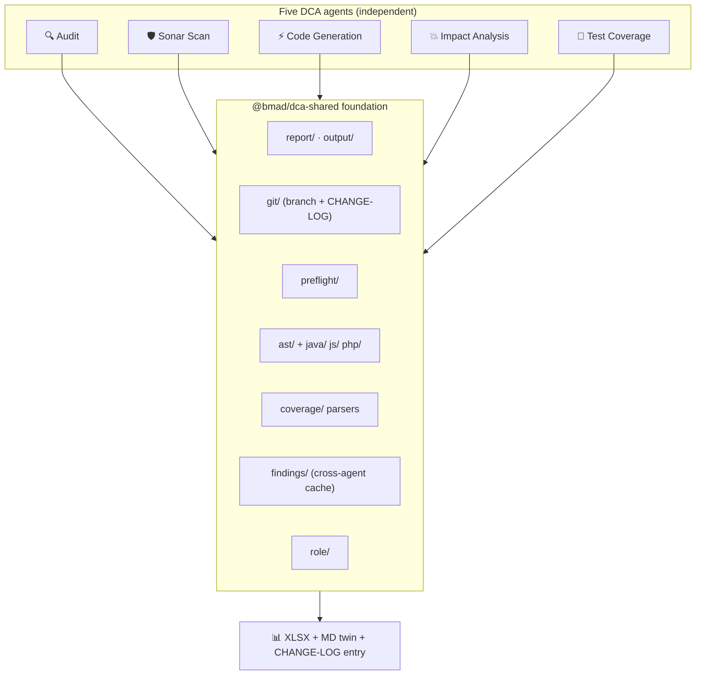

# The 5 Agents

Five independent AI coding agents, each with a deterministic Tier 1 (TypeScript) and an LLM-driven Tier 2, all funneled through one shared `@bmad/dca-shared` foundation so reports, changelog entries, git ops, and preflight look identical across the fleet.

## At a glance

| Agent | Icon | Purpose | When to use | Primary CLI flags | Findings-cache output |
|-------|:-:|---------|-------------|-------------------|----------------------|
| **Audit** | 🔍 | Two-tier code auditor — tree-sitter AST + regex (Tier 1) then LLM deep semantic analysis (Tier 2). | PR gates, upgrade prep, legacy onboarding, quarterly health checks. | `--engine <stack>` · `--path <dir>` · `--platform 
` (AEM) · `--format <t>` | `audit-<hash>.json` |
| **Sonar Scan** | 🛡️ | LLM SonarQube-style pass — Bugs / Vulnerabilities / Hotspots / Smells / Duplications / Complexity → A–E ratings + Quality Gate + Vulnerabilities sheet. | Pre-merge gates, security review, post-refactor validation. | `--ingest <sonar-findings.json>` · `--engine <stack>` | `sonar-scan-<hash>.json` |
| **Code Generation** | ⚡ | 24 deterministic scaffolders across 8 stacks + LLM/MCP path for anything the scaffolders don't cover. Zero-config MCP auto-provisioning for AEM. | Bootstrapping new modules, standardizing team output, prototype scaffolding. | `--scaffold` · `--engine <stack>` · `--type <t>` · `--name <str>` · `--setup` | `generation-<hash>.json` |
| **Impact Analysis** | 💥 | Input-driven reverse-dependency tracer over Proofhub bug CSV and/or BRD doc → impacted files + blast radius + risk score. | Sprint planning, release readiness, BRD-to-code traceability, regression scoping. | `--bugs <csv>` · `--brd <doc>` · `--engine <stack>` | `impact-analysis-<hash>.json` |
| **Test Coverage** | 🧪 | Deterministic gap analysis + real line/branch coverage (JaCoCo / Istanbul / Clover / LCOV) + framework-aware LLM test generation. | Baseline snapshot, real coverage on CI, test-generation sprint, pre-release gate. | `--mode <analyze\|generate\|full>` · `--coverage-report <file>` · `--run-coverage` | `test-coverage-<hash>.json` |

Each agent's full command surface lives in its `SKILL.md`; the flags above are the ones you'll type most often.

## Architecture

Agents are **independent** — invoke any one on its own; there are no ordering dependencies. The canonical SDLC order (Generate → Audit → Sonar Scan → Test Coverage → Impact Analysis) is a convenience for chained workflows, not a requirement. See [Workflows → Chain All](../workflows/chain-all).

## Per-agent detail

### 🔍 Audit

**Tier 1** is a deterministic TypeScript scanner (tree-sitter AST + regex, zero LLM tokens) across all 8 stacks. **Tier 2** is LLM-driven deep semantic analysis using per-stack rule packs. The old standalone `scan-agent` was retired — its Tier-1 pass now lives here as the **Scan Only** action (menu code `SC`).

Standardized output plus, for legacy engines (AEM, Commerce, EDS, EDS+Commerce), an additional platform-specific multi-sheet workbook.

Full flags, trigger phrases, and workflows: **[Audit agent](../agents/audit)**.

### 🛡️ Sonar Scan

LLM-driven SonarQube-style code quality — **no SonarQube server or binary required**. Covers all 6 Sonar pillars, produces **A–E** ratings for Reliability / Security / Maintainability, and a pass/fail **Quality Gate**.

Intentionally **two-step**:

1. **Scan (LLM)** — writes `sonar-findings.json` to `sonar_output`.
2. **Ingest (deterministic)** — `run.ts --ingest sonar-findings.json` computes ratings + Quality Gate and emits the standardized workbook plus a dedicated color-coded **Vulnerabilities** sheet.

Full detail: **[Sonar Scan agent](../agents/sonar-scan)**.

### ⚡ Code Generation

**Tier 1** = 24 correct-by-construction scaffolders across the 8 stacks. **Tier 2** = LLM/MCP path for anything the scaffolders don't cover, with zero-config MCP auto-provisioning for AEM (`--setup` writes `.mcp.json`, `.bmad/mcp-registry.toml`, `.env`, `.gitignore`).

Deterministic scaffolder counts per stack: AEM (5), Sling (4), Spring (3), Commerce PaaS (5), Commerce SaaS (2), App Builder (3), EDS (1), EDS+Commerce (1).

Full detail: **[Code Generation agent](../agents/code-generation)**.

### 💥 Impact Analysis

**Input-driven** blast-radius tracer. Give it a Proofhub CSV (`--bugs`) and/or a BRD document (`--brd` — `.docx` / `.md` / `.txt`). It extracts symbols/paths, scores files, walks reverse dependencies, and emits an **Input Traceability** report where every input item (bug or requirement) appears as a row — items with no code match become an INFO row flagged for manual review.

At least one input (`--bugs` or `--brd`) is required.

Full detail: **[Impact Analysis agent](../agents/impact-analysis)**.

### 🧪 Test Coverage

**Tier 1** = deterministic gap analysis (which files/classes/functions have no test) + optional **real** line/branch coverage from JaCoCo XML, Istanbul JSON, Clover XML, or LCOV. **Tier 2** = LLM-driven test generation to close the gaps toward 100%, per framework (JUnit + AEM/Sling Mocks, Spring Test + MockMvc + Testcontainers, PHPUnit + MFTF, Jest + jsdom).

Modes: `analyze` (gap-only), `generate` (Tier 2), `full` (both).

Full detail: **[Test Coverage agent](../agents/test-coverage)**.

## Cross-agent chaining

Every successful agent run writes a `<agent>-<hash>.json` cache entry to `<projectRoot>/.bmad/cache/`. Downstream agents consume these silently for enrichment:

- **Impact Analysis** — reads the latest Audit cache to boost priority for files with existing CRITICAL findings.
- **Test Coverage** — reads the latest Audit cache to enrich coverage gaps with severity context.
- **Sonar Scan** — reads the latest Audit cache to include delta context in the Quality Gate rationale.

See [Findings Cache](findings-cache).

## Shared foundation

The `@bmad/dca-shared` subdirectories every agent depends on:

| Subdir | Responsibility |
|--------|----------------|
| `report/` | `StandardExcelReport` — fixed sheet order, 15-column Summary contract. |
| `output/` | `emitStandardOutputs()` — writes xlsx + md twin + CHANGE-LOG entry + optional branch cut. |
| `git/` | Branch/timestamp helpers, `CHANGE-LOG.md` writer, `maybeCutStandardBranch`. |
| `preflight/` | Model + context-window detection, project sizing, STATIC / HYBRID / LLM recommendation. |
| `ast/` | web-tree-sitter (WASM) harness — no native build required. |
| `java/` · `js/` · `php/` | Per-language rule libraries shared by every engine that speaks that language. |
| `coverage/` | JaCoCo / Istanbul / Clover / LCOV parsers + report discovery + opt-in runner. |
| `core/` | Shared types (`Finding`, `Severity`, `Confidence`, …). |
| `role/` | Role catalog + persistence at `.bmad/role.yaml`. |
| `interactive/` | Q&A prompter + intake-mode persistence at `.bmad/intake.yaml`. |
| `findings/` | Cross-agent findings cache. |
| `token-budget/` | Token accounting for LLM handoffs. |

## Next

- [The 8 Stacks](the-8-stacks)
- [Standardized Outputs](standardized-outputs)
- Individual agent deep-dives: [Audit](../agents/audit) · [Sonar Scan](../agents/sonar-scan) · [Code Generation](../agents/code-generation) · [Impact Analysis](../agents/impact-analysis) · [Test Coverage](../agents/test-coverage).
